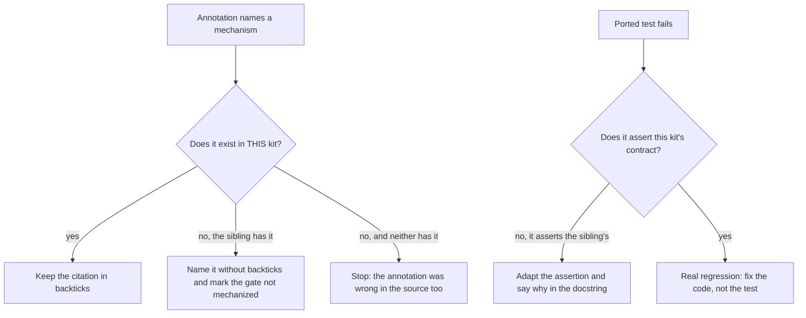

# Port a fix between the Squad and the Cycle

## Purpose
The two kits share ancestry and have diverged; copying a change between them
without checking what each one actually has propagates promises the receiving
kit cannot keep.

This procedure and its run records live in different places on purpose — see
[where knowledge lives](/decisions/where-knowledge-lives.md).

## Prerequisites
- [ ] Both repositories are on `workspace` with a clean tree — `git -C <repo> status --short`.
- [ ] The change is already committed in the source kit — a port from an
      uncommitted tree cannot be re-derived later.
- [ ] The source kit's suite is green — `bash mechanisms/cycle/run_slice_tests.sh`.

## Steps
1. **Measure** the receiving kit before changing it, and write the number down —
   the same gate run there answers a different question than it does here.
2. **Copy** the scripts and their tests verbatim; they are the part that does not
   diverge.
3. **Run** the ported tests in the receiving kit and read every failure as a
   question about divergence, not as a defect to silence.
4. **Adapt** each artifact that encodes THIS kit's contract — phase chains, rule
   names, the skills that exist here — rather than the sibling's.
5. **Verify** every mechanism a rule names exists in the receiving kit —
   `python3 mechanisms/gates/check_gate_mechanisms.py`.
6. **Run** the full battery — slice suite, `check_xrefs.py --strict`,
   `verify_ecosystem.py`.
7. **Install** into a throwaway project and exercise the change for real —
   `bash mechanisms/distribution/install.sh <tmpdir>`.
8. **Record** the port in `CHANGELOG.md`, naming what diverged and what did not.

## Decisions

## Escalation
- **A mechanism the source kit names does not exist here** → stop, name it
  without backticks, and mark the gate `_(not mechanized: <reason>)_`. Decided
  by whoever holds the branch; do not invent a local equivalent under time
  pressure.
- **A ported test fails and it is unclear whether the contract or the code is
  wrong** → stop and ask the kit owner. A test adapted to pass is worse than a
  port abandoned.
- **The receiving kit is AHEAD on the thing being ported** → do not overwrite.
  Record the divergence in the annotation so the next port does not undo it.
- **The two kits' lint configurations disagree about the ported file** → keep
  what the source kit's config requires, and leave the receiving kit's warning.
  Chasing both configurations changes code for a linter rather than a reader.

## Competencies
| Competency | Who may perform | How it is verified |
|---|---|---|
| Reading a gate's verdict and its residue | anyone on the kit | ran `/code-quality` end to end and can say what a soft cap means |
| Telling divergence from regression | kit maintainer | ported one change with a failing test and diagnosed it correctly under review |
| Deciding a gate is not mechanizable here | kit maintainer | wrote one `_(not mechanized: …)_` marker that survived review |

[^run-1]: First run — the three pipeline movements, Squad → Cycle.
[^run-2]: Second run — the SOP family itself, performed by following this document.
