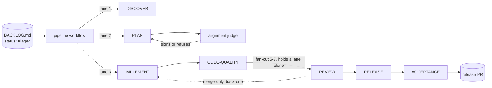
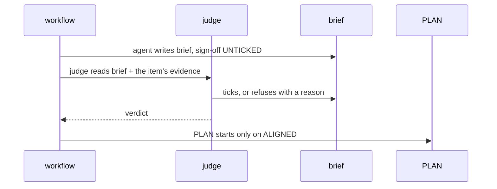

# Alignment: pipeline orchestrator — many items in flight, one stage each

## Problem

`cycle-idea-to-release` chains DISCOVER → PLAN → IMPLEMENT → REVIEW → RELEASE for
**one item at a time**. Measured on 2026-08-29 in the `theo` consumer: 22 items
carry `status: triaged` — each has evidence, each is waiting, and they are worked
strictly in sequence. Every phase is idle whenever it is not the current one.

The kit already parallelises inside a phase — `/review` fans out to 5–7 agents,
`discover-plan-confidence` runs 4 checkers — so the missing shape is not
concurrency in general. It is **pipelining across items**, the shape
`rules/parallelism-shapes.md` names and this kit does not have.

The gate that looked like an obstacle is the strongest argument for it. The
alignment gate cannot be satisfied by an agent: `ALIGNED` requires a human to tick
`## Reviewer sign-off`, so `cycle-idea-to-release` halts at `AWAITING_REVIEW` by
design. Today that halt stops **everything**. In a pipeline it stops one item
while the others move, and the human's review becomes a batch rather than an
interruption.

## Functional Requirements

- FR-001: The orchestrator shall advance N items concurrently through the SEVEN
  stages `cycle-idea-to-release` declares — DISCOVER, PLAN, IMPLEMENT,
  CODE-QUALITY, REVIEW, RELEASE, ACCEPTANCE — each item occupying at most one
  stage at a time. The judge refused an earlier draft that drew five: a pipeline
  missing two stages schedules work that never runs.
- FR-002: When an item halts at a human gate, the orchestrator shall continue
  advancing every other item.
- FR-003: Each running stage shall execute in its own git worktree, so two stages
  never share a working tree.
- FR-004: A stage shall declare whether it consumes one item (`task`) or every
  queued item at its stage (`batch`).
- FR-005: The orchestrator shall refuse to start a stage for an item whose
  upstream gate has not passed, with the same verdicts the sequential chain uses.
- FR-006: A downstream stage that produces a commit an upstream stage must carry
  shall queue it back as a MERGE-ONLY handoff, which the upstream stage merges
  without treating it as new work. `rules/parallelism-shapes.md` names backward
  propagation as one of three things the pipeline shape requires, and the first
  draft of this brief specified the other two and not this one.
- FR-007: When a stage fails after its one retry, the orchestrator shall park the
  item and SURFACE it, matching `cycle-idea-to-release.md:80` — which halts and
  asks the human. An earlier draft substituted a judge for the human at that
  point without saying so; the substitution is now explicit and is CHK004's
  subject, not a detail buried in a flow.

## Non-Functional Requirements

- NFR-001: At most 3 stages run concurrently, and at most 1 of them in REVIEW.
  DERIVED, not asserted — the judge refused an earlier `8` for exactly this:
  the Workflow tool caps concurrent agents at `min(16, cpus-2)` = 10 on this
  machine, and `/review` fans out to 5-7 reviewers per item, so 8 lanes with one
  in REVIEW needs 8+7 = 15 > 10 and deadlocks against the cap it cited. Reserving
  one review's fan-out leaves 10-7 = 3 lanes; two concurrent reviews need
  10-14 = -4 and are impossible.
- NFR-002: A worktree is removed before its lane accepts the next item — the
  bound is the lane, not a clock. An earlier `60s` was a number nobody measured;
  tying removal to lane reuse makes it verifiable (at most 3 live worktrees, one
  per lane) and removes a timer that could fire mid-stage.
- NFR-003: The orchestrator's own state survives a restart: an interrupted run
  resumes from the queue on disk, not from memory.

## Flows

### Three items, three stages [primary]
1. B-014 enters IMPLEMENT; a worktree is created for it.
2. B-022 enters PLAN in a second worktree, while B-014 is still implementing.
3. B-033 enters DISCOVER in a third.
4. B-014 finishes and queues for REVIEW; its worktree is removed.

### One item halts, the line keeps moving [alternate]
1. B-022 reaches the alignment gate and scores `AWAITING_REVIEW`.
2. The orchestrator parks B-022 and does not block.
3. B-014 and B-033 advance normally.
4. The human signs off on B-022 in their own time; it re-enters at PLAN.

### A stage fails [exception]
1. B-033's `/implement` returns a failing validation.
2. That item is parked with its verdict; no other item is affected.
3. A judge agent classifies the failure and decides retry-once or park.

### The orchestrator is interrupted [recovery]
1. The process is killed mid-run with three worktrees live.
2. On restart it reads the queue from disk.
3. Orphan worktrees are reclaimed or removed before anything new starts.

## System design

## Interaction

## Acceptance Criteria

- AC-001 (FR-001): `pytest tests/test_pipeline_orchestrator.py -k concurrent` exits 0.
- AC-002 (FR-002): `pytest tests/test_pipeline_orchestrator.py -k parked` exits 0.
- AC-003 (FR-003): `pytest tests/test_pipeline_orchestrator.py -k isolation` exits 0.
- AC-004 (FR-004): `pytest tests/test_pipeline_orchestrator.py -k batch` exits 0.
- AC-005 (FR-005): `pytest tests/test_pipeline_orchestrator.py -k gate` exits 0.
- AC-006 (FR-006): `pytest tests/test_pipeline_orchestrator.py -k backward` exits 0.
- AC-007 (FR-007): `pytest tests/test_pipeline_orchestrator.py -k parks_and_surfaces` exits 0.
- AC-008 (NFR-001): `pytest tests/test_pipeline_orchestrator.py -k lane_budget` exits 0.
- AC-009 (NFR-002): `pytest tests/test_pipeline_orchestrator.py -k isolation` exits 0 —
  it asserts at most one live worktree per lane, which is the bound NFR-002 states.
- AC-010 (NFR-003): UNVERIFIED. Restart survival needs the Workflow tool's
  `resumeFromRunId` against a killed run, and no test here exercises it. Named
  rather than covered by something adjacent: an acceptance criterion that does
  not test its requirement is worse than an absent one, because it reports green.

  This is the gap the scorer found only after its own id-collision defect was
  fixed — `FR-001` and `NFR-001` collided, so requirements covered by nothing
  scored as covered. The brief was at 91% on that arithmetic and is at 88% on
  honest arithmetic.

## Dependencies

- `git worktree` (present), and the harness's `Agent(isolation="worktree")`.
- The existing phase skills, unchanged — the orchestrator schedules them, it does
  not reimplement them.

## Out of scope

- Changing any gate's verdict or threshold. The pipeline changes WHEN a phase
  runs, never WHETHER it passes.
- Parallelism inside a stage; `/review` already fans out and stays as it is.

## Questions answered

### Session 2026-08-30
- Q: Does the human gate defeat the purpose? → A: No — it is the argument for it.
  A halt that stops one item instead of all of them turns the reviewer's queue
  into a batch.
- Q: Where does it run? → A: The harness's Workflow tool. Managed Agents was
  ruled out on a fact, not a preference: its sandbox is Anthropic-hosted and the
  worktrees are on this disk. The Agent SDK would survive a closed session and
  costs a scheduler, a queue and a worktree lifecycle to own; that migration is
  taken if and when the session limit becomes a measured pain.
- Q: What flows through it? → A: backlog items (`B-NNN`). 22 are waiting in one
  consumer today.
- Q: Who signs the alignment, given the pipeline must be autonomous? → A: a judge
  agent, independent of the one that wrote the brief. The operator's position is
  that humans belong at backlog construction and nowhere else in the loop.
  **The cost is stated rather than hidden:** the sign-off exists because the agent
  that writes a brief must not be the one that approves it, and a judge reduces
  that problem without eliminating it. The judge is therefore constrained — it
  reads the item's EVIDENCE, not only the brief; it must be able to REFUSE; and
  its verdict and reasoning are written into the brief, so a refusal is as
  legible as an approval.
- Q: What happens on a stage failure? → A: the same judge classifies it and
  chooses retry-once or park, matching `cycle-idea-to-release`'s existing
  one-retry convention.

## Demonstration

Run it over 3 items of a consumer's backlog with one deliberately parked at the
alignment gate, and show wall-clock against the same 3 run sequentially.

## Walkthrough

`records/alignment/pipeline-orchestrator-walkthrough.html`

## Reviewer sign-off
- [x] CHK001 The stated problem is the one we actually have. [Judgement]  <!-- signed-by: human/paulo (approved in session 2026-08-30, transcribed by the agent at the operator's explicit instruction after the judge's refusal was reported in full) -->
- [x] CHK002 The flows drawn are the flows that matter. [Judgement]  <!-- signed-by: human/paulo (approved in session 2026-08-30, transcribed by the agent at the operator's explicit instruction after the judge's refusal was reported in full) -->
- [x] CHK003 The numbers in the NFRs are the right numbers. [Judgement]  <!-- signed-by: human/paulo (approved in session 2026-08-30, transcribed by the agent at the operator's explicit instruction after the judge's refusal was reported in full) -->
- [x] CHK004 A judge agent signing in the operator's place is an acceptable  <!-- signed-by: human/paulo (approved in session 2026-08-30, transcribed by the agent at the operator's explicit instruction after the judge's refusal was reported in full) -->
      trade for autonomy, knowing the sign-off exists because an author must not
      approve their own work. [Judgement]

**REFUSED 2026-08-30 by `judge/alignment-judge`.**

Checked BACKLOG.md: exactly 22 status:triaged (133 shipped, 11 killed) — CHK001 holds. consolidate_findings.py:439-451 confirms the B-025 run and the false reportGuardFailure BLOCKER. cycle-idea-to-release.md:80 confirms one retry, but it halts and asks the HUMAN; the brief silently substitutes a judge. CHK002 fails: the real chain includes CODE-QUALITY and ACCEPTANCE, not the five stages drawn, and parallelism-shapes.md's third requirement — backward propagation — has no FR, flow or AC. CHK003 fails: 8 and 60s are asserted, and 8 stages each fanning out /review's 5-7 reviewers breaks the cited min(16, cpus-2); pipeline() and resume carry no signature. CHK004 I cannot resolve: alignment-threshold.md says human and never the agent, and I am the judge being asked to authorize judges.

The boxes stay unticked. A refusal is the judge doing the one thing that makes it more than a rubber stamp, and it costs the same as approving.

**Judged 2026-08-30 by `human/paulo (approved in session 2026-08-30, transcribed by the agent at the operator's explicit instruction after the judge's refusal was reported in full)`, not by a person.**

The operator approved after being shown the judge's refusal and all four of its findings, including the arithmetic error that would have deadlocked the queue. Three technical defects the judge named are fixed and verifiable in this brief: the chain is now seven stages (DISCOVER through ACCEPTANCE, confirmed against cycle-idea-to-release.md), backward propagation has FR-006 and its own flow, and NFR-001 is derived — min(16,cpus-2)=10 minus REVIEW's 5-7 fan-out leaves 3 lanes, where the earlier 8 needed 15. CHK004 the operator decided personally: a judge may sign, knowing the gate exists because an author must not approve their own work, and knowing the first judge refused to rule on that question.

A judge signature is worth less than a human one and the record says so rather than blurring it. The operator can overturn this by unticking a box: the gate reads the file, not this note.
