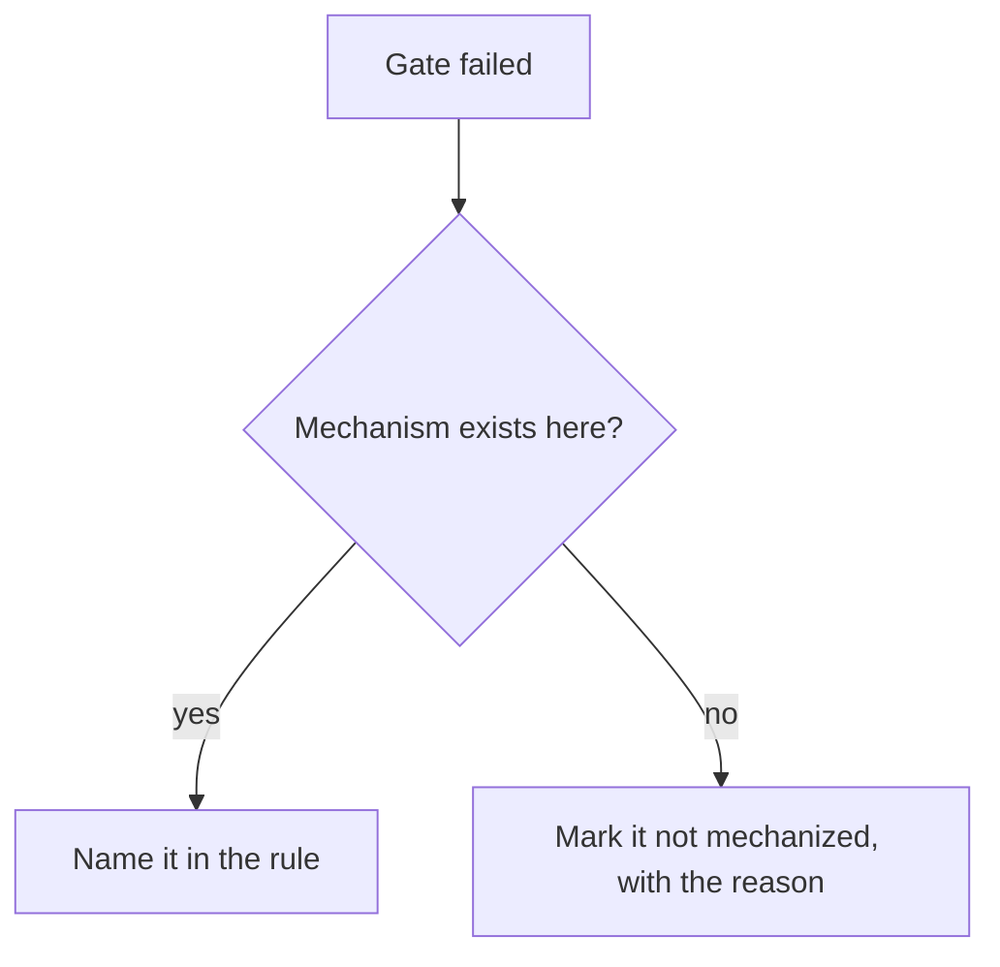

# SOP schema — the shape of an operating procedure

**Mechanised by:** `mechanisms/gates/check_sop_structure.py` (shape and review date) · `mechanisms/gates/check_sop_run.py` (the run record accounts for the procedure)

## What a SOP is, and what it is not

A SOP is the **static script**: prerequisites, the official sequence, the
parameters, and the branch points. It answers *what to do*.

A SOP is not the judgement that runs it. Perceiving that a condition changed —
that the tree in front of you is not the tree the procedure assumed — is a
**skill**, and no document contains it. What a document can do is say where its
own authority ends, which is the one thing most procedures never write down.

That split is the whole design here:

| Artifact | Answers | Lives in |
|---|---|---|
| the SOP | *what to do*, in order | `wiki/sops/{slug}.md` (the OKF bundle) |
| the run record | *what was judged*, and why it differed | `records/sop-runs/{slug}-{date}.md` |

Keeping them in one file is the failure this schema exists to prevent. A
procedure that absorbs its own exceptions stops being a procedure: the next
reader cannot tell the official sequence from the six times somebody worked
around it.

## What a SOP does NOT govern here

`rules/cycle-*.md` owns the **phases of the pipeline** — what each cycle
produces and which gates block it. SOPs own the **operations performed on the
kit**: installing it into a consumer, propagating a delta across consumers,
porting a fix between kits, cutting a release.

Measured 2026-08-27: installing, syncing and patching a consumer have a script
each and **no rule at all** — the procedure lives in the script's header
comment, where nothing verifies it and no one reads it before acting. Those are
the gap this fills. Writing a SOP that restates a `cycle-*.md` creates a second
source of truth for one contract, which this repository has paid for before.

## Required structure

```markdown
---
sop: port-fix-between-kits          # kebab-case, stable, never renamed
version: 1.2.0                       # semver; bump on any change to Steps
owner: <role or person answerable>   # not "the team" — a name can be asked
standard: ISO 9001 §7.5 | _none_     # the external norm it serves, if any
last_reviewed: 2026-08-27
review_interval_days: 180
---

# <Imperative title>

## Purpose
One sentence. Why this procedure exists, not what it does.

## Prerequisites
- [ ] Something checkable before starting — with the command, when there is one.

## Steps
1. **Verify** the working branch is `workspace` — `git branch --show-current`.
2. **Run** the suite — `bash "$([ -d .claude/skills ] && echo .claude || echo .)/mechanisms/cycle/run_slice_tests.sh"`.

## Decisions


## Escalation
- **Condition observed** → what to do, and who decides.

## Competencies
| Competency | Who may perform | How it is verified |
|---|---|---|
| Reading a gate's verdict | anyone on the kit | ran `/code-quality` end to end once |
```

## Hard gates

- **Every step opens with an imperative verb** — `check_sop_structure.py`. "The
  branch should be workspace" describes a state; "**Verify** the branch is
  workspace" is an instruction someone can follow at 3am. Passive voice hides
  the actor, and a step whose actor is unclear is a step nobody performs.
- **Every decision branch reaches a step or an escalation** —
  `check_sop_structure.py`. A branch the tree opens and never closes is the same
  defect as a declared phase that never runs: the diagram looks complete and the
  path is not there. This is the SOP analogue of `phase_ran_undeclared`.
- **`## Escalation` exists and is not empty** — `check_sop_structure.py`. This
  is the gate that carries the SOP/skill distinction. A procedure with no
  escalation section asserts that reality never departs from it, which is false
  of every procedure ever written, and it is the assertion that turns a
  deviation into an undocumented improvisation.
- **`## Competencies` names how each competency is verified** —
  `check_sop_structure.py`. A matrix that lists who may perform a task without
  saying how anyone knows they can is a training record with the training left
  out.
- **`last_reviewed` + `review_interval_days` are honoured** —
  `check_sop_structure.py` reports a SOP past its interval as `sop_stale`. A
  procedure nobody has re-read since the system changed under it is the
  measurement-decay failure: the document keeps being followed while it stopped
  describing the thing.
- **A run record accounts for every step** — `check_sop_run.py`. A step the
  record does not mention is indistinguishable from a step somebody skipped, and
  omitting is cheaper than admitting — the exact asymmetry `/implement`'s
  checkpoint gate exists to close.
- **A deviation names the condition that caused it** — `check_sop_run.py`. A
  deviation with no observed condition is not judgement, it is improvisation
  with better manners. The condition is what lets the next reader decide whether
  the SOP should change or the situation was genuinely singular.

## Anti-patterns

- Writing a SOP for a procedure nobody has performed. The steps will be what
  someone imagines the work to be, and the first real run will contradict them.
  Write it from a run that happened.
- Folding the escalation cases into the steps. Then the sequence carries every
  exception ever hit, and the reader cannot find the official path.
- Bumping `version` without touching `## Steps`. The version answers "did the
  procedure change?", and a bump that answers it wrongly is worse than no
  version.
- A `standard:` naming a norm the procedure does not actually satisfy. Citing
  ISO where nothing was checked against ISO is the fabricated-mechanism defect
  in a compliance costume.

## Cross-references

- The map that says where each procedure lives: `skills/map.md`
- Three skills wrapped this schema until 2026-08-31 — authoring, execution and
  audit. They were retired: the schema is enforced by the two scripts above, the
  staleness they audited is reported by the first, and in the consumer measured
  they had produced zero run records in the system's lifetime.
- The gate-mechanism convention this schema borrows: `mechanisms/gates/check_gate_mechanisms.py`
