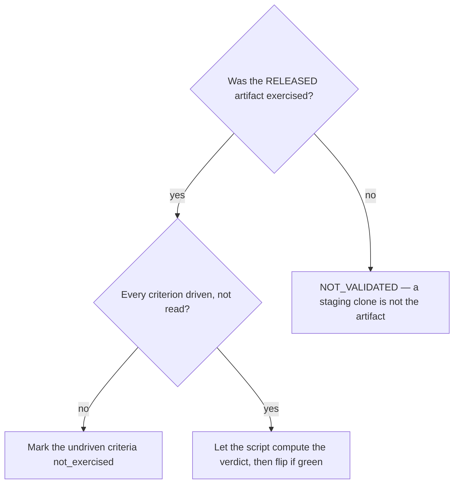

# Accept a released milestone

## Purpose

Establish that what was released does what the milestone promised, by driving it rather than by reading it.

## Prerequisites

- The release exists and is the artifact that will be exercised. A local build, a staging clone or a mock reproduces exactly the blind spot this cycle removes.
- The milestone's Definition-of-done bullets are in `ROADMAP.md` — they are the acceptance criteria.

## Steps

1. Run `/acceptance M{N}`.
2. Drive each Definition-of-done bullet against the released artifact.
3. Record evidence per criterion. A criterion nobody drove is `not_exercised`, never `passed`.
4. Let the script compute the verdict. Never assert it.
5. File an issue for every caveat before accepting with caveats.

## Decisions

| Verdict | What it means | What follows |
|---|---|---|
| `ACCEPTED` | Every criterion exercised and passed | The checkbox may flip |
| `ACCEPTED_WITH_CAVEATS` | Passed with known defects | The checkbox may flip once every caveat has an issue |
| `NOT_VALIDATED` | Criteria were not exercised | The checkbox does not flip |
| `REJECTED` | The released artifact does not meet the promise | Back to the cycle |

## Escalation

- A criterion cannot be exercised from here → record it as not exercised. → whoever can drive it; an untested promise stays untested.
- A caveat has no owner → do not accept yet. → `ACCEPTED_WITH_CAVEATS` without an issue per defect turns a known problem into an unowned one.

## Competencies

- Knowing that re-running the test suite is not acceptance. That check passed three phases ago and measures something else.
- Reading code is not exercising it, and the distinction is the whole cycle.
