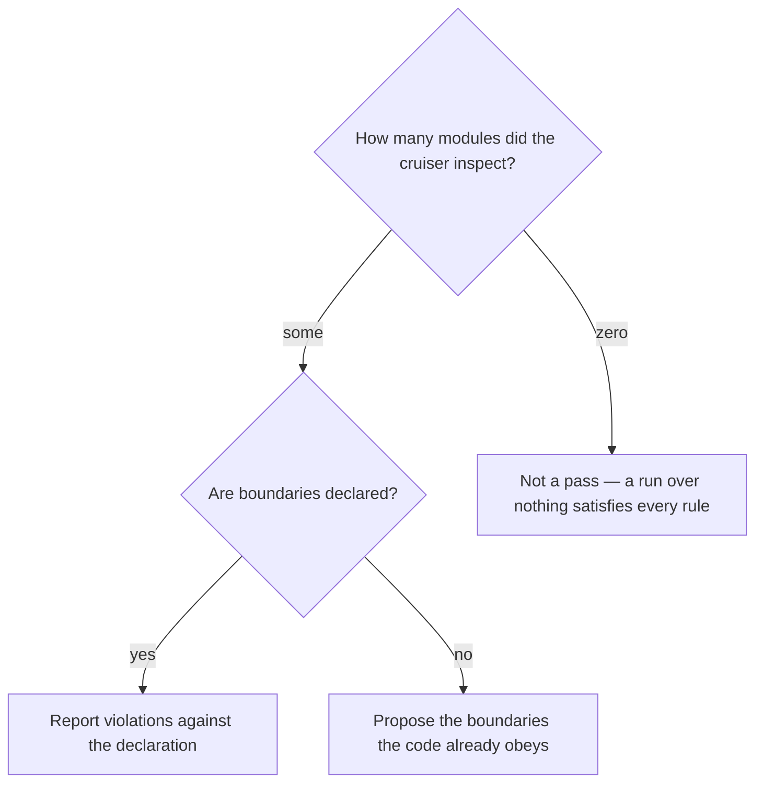

# Check architecture boundaries

## Purpose

Establish whether the declared dependency directions still hold, and whether the declaration can still fail.

## Prerequisites

- The repository has a language the tooling covers — dependency-cruiser, go-arch-lint, layered-crate or import-linter.
- Either boundaries are declared, or you accept a proposal derived from what the code already does.

## Steps

1. Run `/arch-check`.
2. Confirm the cruiser actually inspected modules. A run that reaches zero modules passes every rule without looking at anything.
3. Read a proposal as a description of current behaviour, not as an aspiration.
4. Fix violations in the code, or record the boundary change as a decision.

## Decisions

| State | What it means | What follows |
|---|---|---|
| Rules declared and held | The boundaries are real | Nothing to do |
| Rules declared and violated | The code drifted from the declaration | Fix the code, or change the rule deliberately |
| No rules declared | Nothing constrains direction | Adopt the proposal, or decide not to |
| Zero modules cruised | The check ran and inspected nothing | Fix the configuration; this is not a pass |

## Escalation

- A violation is intentional → the rule is wrong, not the code. → change it as a recorded decision, never by silencing the check.
- The tool is missing → the boundaries were not verified. → whoever owns the environment.

## Competencies

- Reading an empty cruise as a failed check. Zero modules passes everything.
- Telling a proposal from a guarantee: it describes what the code does today.
