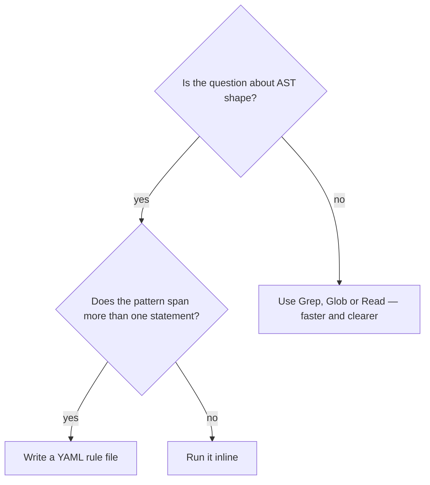

# Search a codebase by AST shape

## Purpose

Answer questions about code STRUCTURE: signatures, hierarchies, decorator plus function, call sites, async shapes.

## Prerequisites

- `ast-grep` is installed.
- The question is about shape. If it is about a word in a file, this is the wrong tool.

## Steps

1. Decide whether the question is structural. "Find the file whose name contains X" is not.
2. Write the pattern in a YAML rule file when it spans more than one statement — an inline multi-statement pattern raises "Multiple AST nodes".
3. Run `/ast-grep {pattern}`.
4. Read the matches as shapes, and confirm one by opening it.

## Decisions

| Question | Right tool |
|---|---|
| Which files mention this word | Grep |
| Where is this file | Glob |
| What does this file say | Read |
| Which functions take this signature, or call this in an async block | ast-grep |

## Escalation

- The pattern matches nothing and the shape plainly exists → the language grammar or the pattern is wrong. → confirm against a known example before concluding absence.

## Competencies

- Knowing when Grep is the better tool. Reaching for AST matching on a text question costs time and clarity.
- Reading "no matches" as a claim that needs one positive control before it is trusted.
