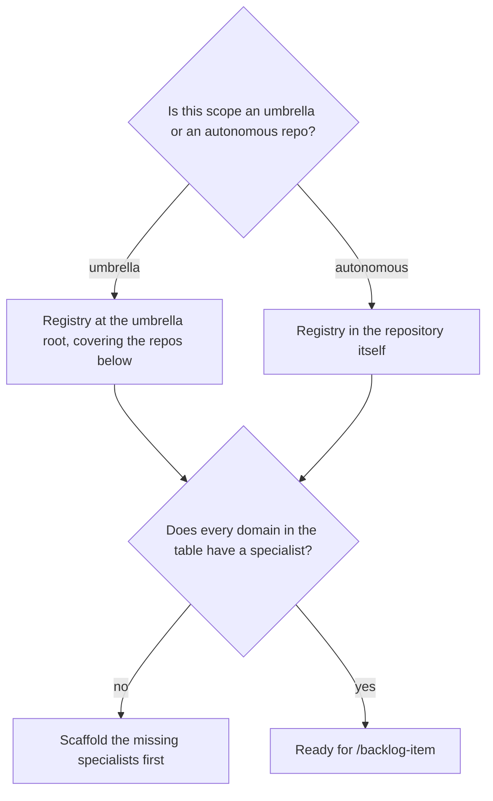

# Bootstrap the backlog registry

## Purpose

Give a project the registry every later phase reads, with an inventory taken from disk rather than from documentation.

## Prerequisites

- No `BACKLOG.md` exists yet. This runs once per governed scope.
- Read access to the repositories the scope covers.
- `detect_scope` can answer whether this is an umbrella grouping repositories, or an autonomous repository.

## Steps

1. Run `/backlog-init`.
2. Confirm the scope it detected. An umbrella and an autonomous repository get registries in different places, and putting one at the other's root writes it outside the project.
3. Let the inventory come from `find` and `git -C`. Never transcribe it from `CLAUDE.md`.
4. Review the derived routing table: one domain per specialist, every repository routed.
5. Scaffold the specialists the table names, or `route_domain.py` exits 3 for every item.
6. Leave the registry empty of items.

## Decisions

| State | What it means | What follows |
|---|---|---|
| Registry written, table derived, specialists present | The project can route work | `/backlog-item` |
| Table names a domain with no specialist on disk | Routing is broken for that domain | Scaffold it before filing anything |
| A repository the inventory names has no checkout | The divergence is real | Keep it listed and marked, rather than deleted |

## Escalation

- The inventory and the documentation disagree → disk wins. → record the divergence rather than resolving it silently.
- A repository belongs to no domain → the topology is unclear. → whoever owns the layout decides before items are filed against it.

## Competencies

- Treating documentation as a claim and disk as the fact.
- Refusing to seed "obvious" items. Every item needs a human `why_now` and a DoD, and pre-filled ones have neither.
