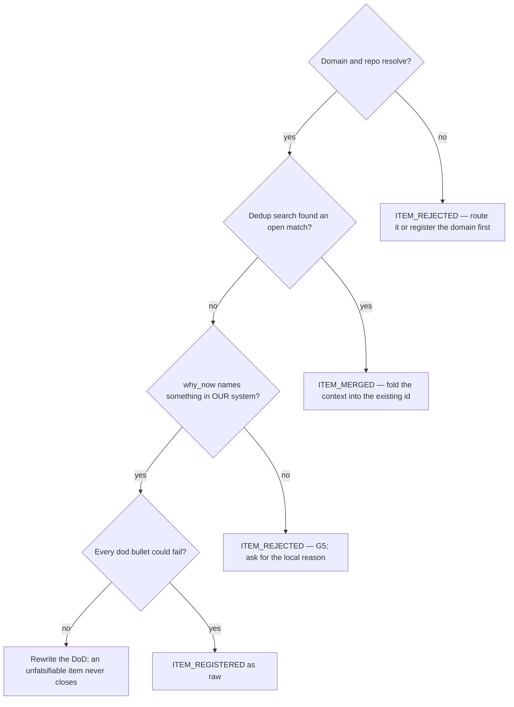

# Register one item in the backlog

## Purpose

Capture one unit of maintenance work as the next `B-NNN`, as a **hypothesis**.
Evidence is not required here and asking for it is the anti-pattern: this is the
phase that catches the hunch, and `cycle-discover` is what turns it into evidence
or kills it.

## Prerequisites

- `BACKLOG.md` exists. If not, run `/backlog-init` first — once, for the scope.
- The `domain` and `repo` this touches are in the registered set. An item nobody
  owns is an item nobody does.
- A reason the item exists **now**, drawn from something that changed in our own
  system.

## Steps

1. Run `/backlog-item` and answer the intake grill one question at a time.
2. State `why_now` from our system. A blog post, a peer project or "X does it
   this way" is the one justification this phase refuses.
3. Name a `dod` whose bullets could fail. "Improve performance" never closes.
4. Let the dedup search run before anything is written — running it IS the
   evidence that G2 was honoured.
5. Read the verdict, and act on it per Decisions below.
6. Leave the item `raw`. Advancing it is `cycle-discover`'s job, and a status
   written by hand skips the measurement that earns it.

## Decisions

| Verdict | What happened | What follows |
|---|---|---|
| `ITEM_REGISTERED` | Written to `BACKLOG.md` as `raw` | Available for `/discover-plan` |
| `ITEM_MERGED` | The dedup gate matched an open item and folded the new context into it | No new id; the existing `B-NNN` proceeds |
| `ITEM_REJECTED` | Outside the ecosystem, or G5 refused the justification | Nothing is written; the reason goes back to the person |

## Escalation

- The description spans two domains → split it. One item, one specialist. → the
  person filing decides the split; no regex settles it (G3, unmechanised by
  decision).
- G5 fires and the local reason is not obvious → **do not** invent one. Register a
  spike that measures whether the problem exists here. → measured 2026-08-28: a
  model refused a prior-art justification and then wrote an invented local one,
  which passes review more easily than the citation it replaced.
- The item is blocked by a decision nobody has made → write `blocked_by` naming
  it. → the sponsor. An impediment recorded is a work order; an impediment in
  someone's head is not.

## Competencies

- Holding the line that intake takes a **hypothesis**. Asking for evidence here
  turns intake into triage and silences exactly the hunch worth capturing.
- Recognising the fabricated local problem, which is the harder half of G5: an
  appeal to authority is easy to spot, and an invented "shutdown is scattered,
  error propagation is unclear" reads like diligence.
- Writing a Definition of done whose bullets can fail. If nothing could refute
  it, nothing can close it.
