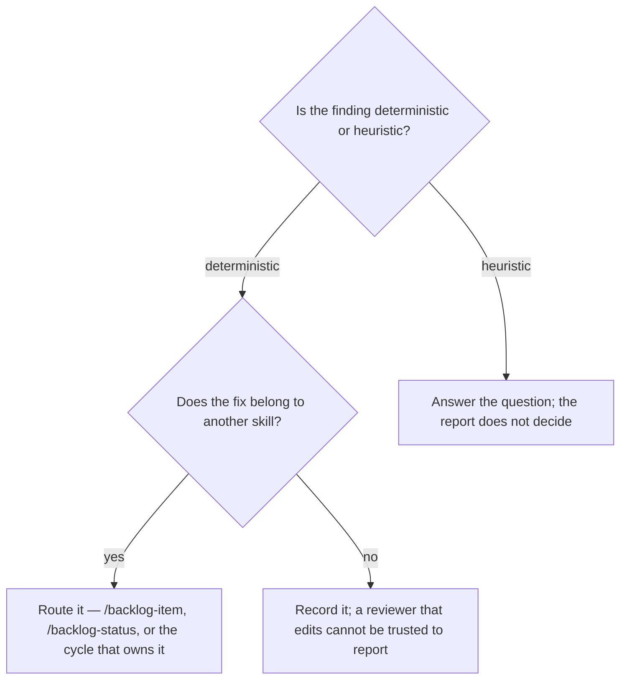

# Review what has rotted in the registry

## Purpose

Produce a picture of the registry's health before anything selects work from it.

## Prerequisites

- `BACKLOG.md` exists.
- Nothing else. This procedure reads and never writes.

## Steps

1. Run `/backlog-review`.
2. Read deterministic findings as facts and heuristic ones as questions.
3. Answer the heuristic questions yourself — `possible_duplicate` and `vague_dod` ask, they do not decide.
4. File the corrections through the skills that own them, never by editing `BACKLOG.md` from here.

## Decisions

| Finding kind | Confidence | What follows |
|---|---|---|
| Deterministic — duplicate id, unresolved `blocked_by`, kill with no reason | Fact | Fix it through the owning skill |
| Heuristic — `possible_duplicate`, `vague_dod` | A question | A person answers it |
| Unrouted repository | Fact | The routing table is incomplete |

## Escalation

- A finding needs a registry write → this skill will not make it. → the skill that owns the field does.
- Every selectable item is blocked → that is a wall, not an empty backlog. → clear the causes rather than filing new items beside them.

## Competencies

- Reading a heuristic as a question. Treating `possible_duplicate` as certain merges two real items.
- Holding read-only. A reviewer that fixes what it finds cannot be trusted to report what it found.
