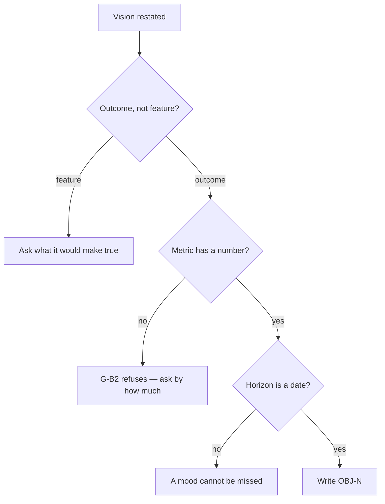

# Derive the product objectives

## Purpose

Produce the ids every requirement cites and every backlog item traces to, so
that an objective nothing serves and shipped work serving no objective both become
computable facts rather than impressions.

## Prerequisites

- `wiki/product/product-vision.md` exists.
- The same person from phase 1 is present.

## Steps

1. **Restate** the problem and named user from the vision, out loud, before asking anything.
2. **Ask** three questions per objective, one per turn: what must be true; how we would know (the number); by when.
3. **Refuse** any metric with no digit in it — gate G-B2, a floor cap rather than a scored criterion.
4. **Capture** `why` for each, drawn from something observed rather than from a peer product.
5. **Aim** for three to five objectives.
6. **Write** `wiki/product/objectives.md` using `## OBJ-N — title` blocks with `metric:`, `horizon:` and `why:`.
7. **Score** early — run `score_product_alignment.py` and read the objectives criteria even though the cascade is still INVALID.

## Decisions

| Outcome | What it means | Do |
|---|---|---|
| Every objective has a number and a date | Phase complete | `/brainstorm-trd` |
| A metric has no number | G-B2 floor cap fires | Ask what would be different, and by how much |
| The number needs instrumentation nobody built | The measurement is itself work | Say so in the objective; it becomes a `B-NNN` later |
| More than five objectives | None of them is a priority | Merge or drop, in the session record |

## Escalation

- **An objective is a feature and the person insists** → record it as written and flag it in the session record. The scorer will not catch this; only a reader will.
- **The metric can only be observed by a person's judgement** → it is not a metric. Either find the observable proxy or move the statement into the vision.

## Competencies

| Competency | Who may perform | How it is verified |
|---|---|---|
| Choosing the metric | the product owner | the metric survives phase 4 sign-off |
| Recognising activity metrics | anyone on the kit | can name why throughput is not an outcome |
