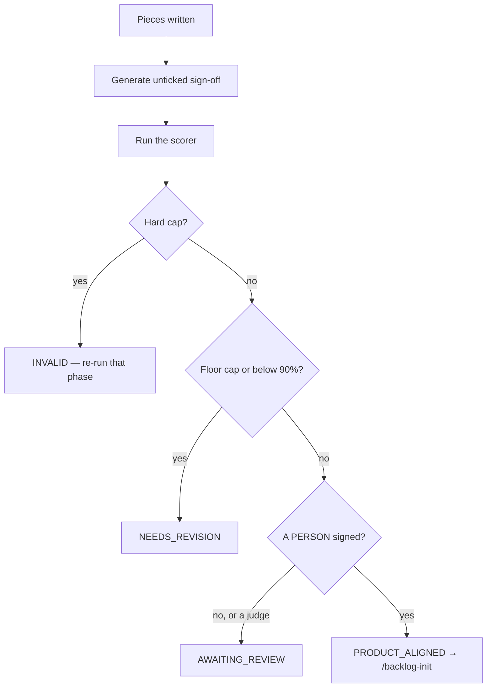

# Name the pieces and run the alignment gate

## Purpose

Decide what the system is made of, and then establish — with a measured score
and a person's signature — whether there is enough agreement for every later phase to
run without anyone watching.

## Prerequisites

- `.squad/wiki/product/trd.md` exists and every `serves:` citation resolves.
- The person from phases 1 to 3 is present. **The phase cannot complete without them.**

## Steps

1. **Ask** two questions per piece, one per turn: what it owns; which requirements it realises.
2. **Run** the reverse check out loud — is every `REQ-N` realised by some piece?
3. **Write** `.squad/wiki/product/technical-pieces.md` using `## PIECE-N — title` blocks with `realises:` and `responsibility:`.
4. **Generate** `.squad/wiki/product/alignment.md` with the sign-off checklist **always unticked**. Never tick a box.
5. **Run** the gate — `python3 skills/brainstorm-pieces/scripts/score_product_alignment.py --root .`.
6. **Ask** the person to review and sign, replacing `<!-- signed-by: -->` with their name.
7. **Emit** the verdict event, including `AWAITING_REVIEW` — a phase that stopped at a human gate ended, it did not skip.

## Decisions

| Verdict | Exit | What it means | Do |
|---|---|---|---|
| `PRODUCT_ALIGNED` | 0 | ≥ 90%, citations resolve, a person signed | `/backlog-init`; the chain may run unattended |
| `AWAITING_REVIEW` | 1 | Structure complete, nobody signed | Ask for the review. Not a failure and not a pass |
| `NEEDS_REVISION` | 1 | Below the floor, or a floor cap fired | Re-enter at the phase the report names |
| `INVALID` | 2 | A document missing, or a citation with no referent | Re-run that phase; editing cannot fix it |

## Escalation

- **The person is not available to sign** → emit `AWAITING_REVIEW` and stop. `alignment_judge.py` may not stand in here; a judge grading a product vision grades it against nothing.
- **The score passes but the person disagrees** → they do not sign. The number measures structure; the signature measures agreement, and the checklist covers exactly what the number cannot.
- **A requirement no piece realises** → agreed work with nobody to do it. Add the piece, or drop the requirement in phase 3.

## Competencies

| Competency | Who may perform | How it is verified |
|---|---|---|
| Signing the alignment | the product owner, never the agent | `signed-by:` names a person, and the scorer reports it |
| Cutting pieces at the right granularity | anyone on the kit | responsibilities differ between pieces |
