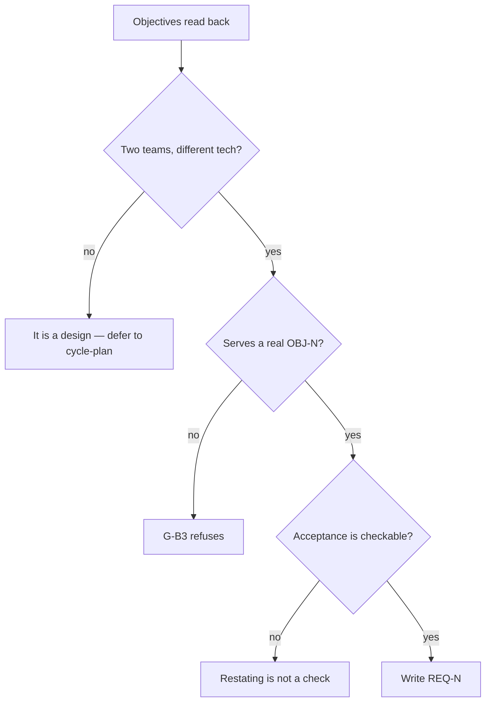

# Write the technical requirements

## Purpose

State what the system must do, separately from how it will do it, so that the
design decisions get their gates in `cycle-plan` instead of arriving pre-made inside
an agreed document.

## Prerequisites

- `.squad/wiki/product/objectives.md` exists and its objectives carry metrics.
- The same person from phases 1 and 2 is present.

## Steps

1. **Read** each `OBJ-N` and its metric back before asking anything.
2. **Work** objective by objective, finishing one before starting the next — that is what makes an objective with no requirements visible.
3. **Apply** the two-teams test to every requirement: could two competent teams satisfy this with different technology? If not, it is a design.
4. **Ask** three questions per requirement, one per turn: what must be true; which objective it serves; how someone checks it.
5. **Write** `.squad/wiki/product/trd.md` using `## REQ-N — title` blocks with `serves:`, `statement:` and `acceptance:`.
6. **Verify** every citation resolves before moving on — a dangling one caps the cascade at INVALID.

## Decisions

| Outcome | What it means | Do |
|---|---|---|
| Every REQ cites a resolving OBJ | Phase complete | `/brainstorm-pieces` |
| A requirement names a technology | A design decision made without its gates | Ask what that technology would achieve |
| A requirement serves no objective | G-B3 refuses it | Drop it, or add the objective it implies — in phase 2 |
| An objective has no requirements | Unreachable, or nobody knows how | Findings worth having; record which |
| A requirement serves every objective | It is a principle | Move it to the vision |

## Escalation

- **The person wants to fix the stack now** → record the preference in the session record and carry it into `/plan-write` as context. It is not lost, it is deferred to where it gets audited.
- **A citation will not resolve because the objective was dropped** → go back to phase 2. Editing the TRD cannot fix a missing referent.

## Competencies

| Competency | Who may perform | How it is verified |
|---|---|---|
| Telling a requirement from a design | anyone on the kit | applies the two-teams test unprompted |
| Writing a checkable acceptance | anyone on the kit | the check can fail |
