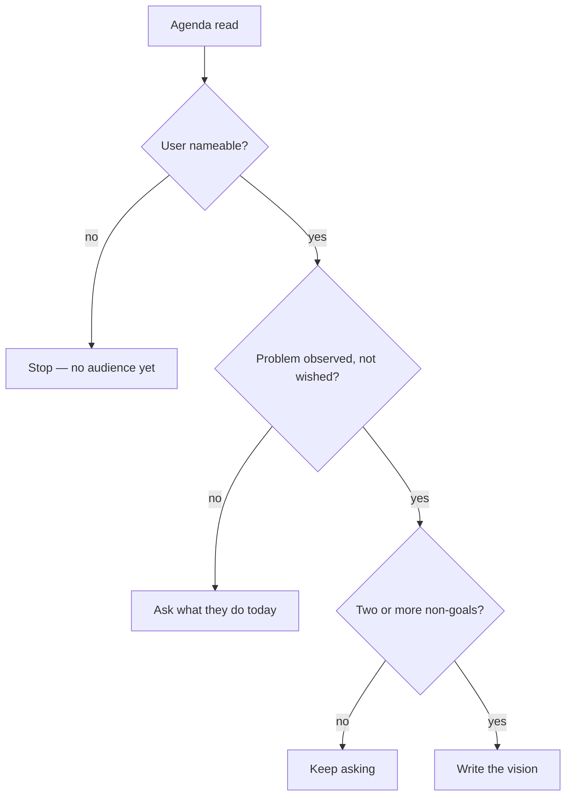

# Run the product vision session

## Purpose

Establish, with a person present, the one document the rest of the pipeline
is measured against. This is the first of the two phases a human attends; everything
after `/backlog-init` runs unattended, and that is only defensible if this happened.

## Prerequisites

- A person who will stay for the session. There is no unattended mode.
- `CHANGELOG.md` exists at the scope root (Unbreakable Rule 6).
- The scope is decided — which repository, umbrella or product this describes.

## Steps

1. **Build** the agenda first — `python3 skills/brainstorm-vision/scripts/build_agenda.py --root .` — and read it to the person before asking anything.
2. **Emit** the phase start — `python3 mechanisms/cycle/cycle_events.py start --cycle brainstorm --slug {scope}`.
3. **Ask** the four questions, one per turn, persisting after each answer.
4. **Refuse** a user who is a category ("developers", "users") and ask again for someone whose situation can be pictured.
5. **Insist** on at least two non-goals. This is the section that settles later arguments.
6. **Write** `.squad/wiki/product/product-vision.md` with the four named sections, plus the session record under `.squad/records/brainstorms/`.
7. **Record** what was discarded and why — the session record is the only thing that can answer "did we consider X?" later.

## Decisions

| Outcome | What it means | Do |
|---|---|---|
| Four sections written | Phase complete | `/brainstorm-objectives` |
| The person cannot name a user | The product has no audience yet | Stop. This is not a documentation problem |
| The problem is stated as the absence of a solution | It describes the fix, negated | Ask what the person does today, and what it costs |
| Fewer than two non-goals | Nothing has been ruled out | Keep asking; this is the phase's whole value |

## Escalation

- **The agenda names a halted item needing a decision** → take the decision in this session; that is what the session is for. Do not let it redirect the vision.
- **Two people disagree about the user** → the disagreement is the finding. Record both in the session record and do not average them into one vague answer.
- **Nobody is available** → do not run it. A vision agreed with its own author agrees with everything.

## Competencies

| Competency | Who may perform | How it is verified |
|---|---|---|
| Deciding what the product is | the product owner | they sign `alignment.md` in phase 4 |
| Running the session | anyone on the kit | read `cycle-brainstorm.md` end to end |
