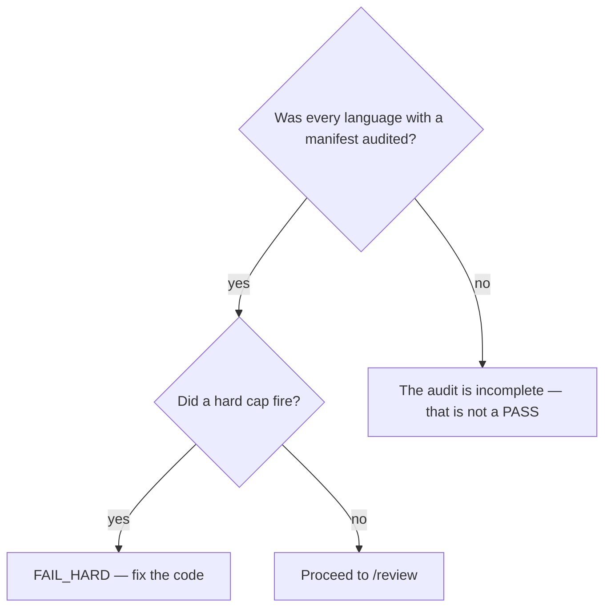

# Audit the tree for dead code and fabricated symbols

## Purpose

Find dead symbols, fabricated APIs, cross-package orphans and weak tests before the work reaches review.

## Prerequisites

- The `/implement` halt-loop has closed.
- The languages to audit are enabled in `rules/code-quality-languages.txt`.
- The scanners those languages need are installed.

## Steps

1. Run `/code-quality {slug}`.
2. Read which languages were audited, and confirm that set is the set that exists. An audit of one language in a two-language repository looked at something, just not at that.
3. Treat `symbol_fabrication_*` and `dead_code_unallowlisted_*` as hard caps: they are structural, not severity opinions.
4. Fix the code. Never edit an allowlist to make a finding disappear.

## Decisions

| Verdict | What it means | What follows |
|---|---|---|
| `PASS` | No hard cap fired over the audited set | `/review` |
| `FAIL_SOFT` | Soft caps only | Fix or accept with the caveat recorded |
| `FAIL_HARD` | A fabricated symbol or unallowlisted dead code | Fix the code; the cap does not lift by allowlist |

## Escalation

- A scanner is missing → the language was not audited. → whoever owns the environment; an unaudited language is not a clean one.
- A finding is a false positive → an allowlist entry needs its reason on the line. → never `--force`, `--skip-checks` or `--accept-caveats`.

## Competencies

- Reading "it looked at something" apart from "it looked at that". The languages audited is the first number to check.
- Knowing this skill is read-only by contract, so every fix happens elsewhere and is re-audited here.
