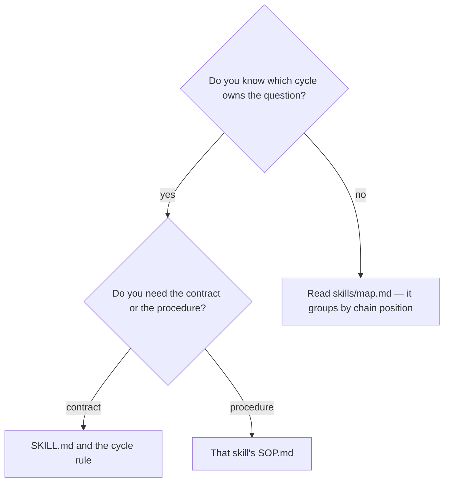

# List the available commands

## Purpose

Orient someone who does not yet know which command answers their question.

## Prerequisites

- None. This reads and reports.

## Steps

1. Run `/commands-help`.
2. Find the cycle that owns the question, then the command inside it.
3. Open that skill's `SOP.md` for how to run it, and its `SKILL.md` for the contract.

## Decisions

| What you need | Where to go |
|---|---|
| Which command exists | This skill |
| How to operate one | That skill's `SOP.md` |
| What it guarantees | That skill's `SKILL.md` and its cycle rule |
| What every skill is for, and what not to use it for | `skills/map.md` |

## Escalation

- The index and a skill disagree → the skill wins. → the disagreement is a defect worth reporting.

## Competencies

- Treating an index as a way in rather than as an authority.
