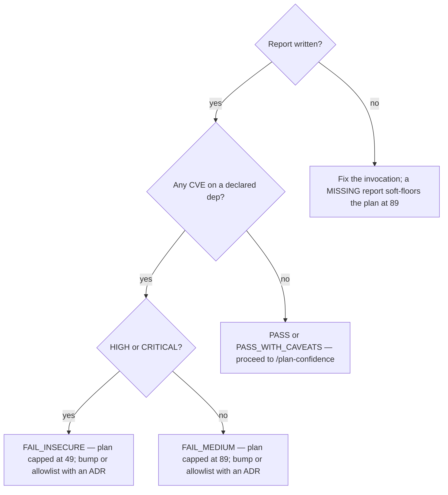

# Run the dependency audit for a plan

## Purpose

Produce a CVE and version verdict for every dependency a plan declares, **before
any code is written**, and leave that verdict on disk where `/plan-confidence`
will read it.

## Prerequisites

- A plan exists at `.squad/records/plans/{slug}-plan.md`.
- `/plan-edge-cases` has run — this is phase 3 and that is phase 2.
- The plan has a `## Dependencies` section. Without one the verdict is
  `INVALID_PLAN_DEPS` and the fix is structural, in `/plan-write`.
- The scanners the project needs are installed (`osv-scanner`, `npm audit`,
  `pip-audit`, `cargo audit`, `govulncheck`, as the manifests require).

## Steps

1. Run `/deps-audit {slug}`.
2. Read the verdict at the head of `.squad/records/audits/{slug}-deps-audit-*.md`.
3. Act on the verdict per the Decisions section below.
4. Re-run this procedure after any change to the plan's `## Dependencies`
   section — `check_deps_audit.py` binds the plan to the **newest** report on
   disk, so a stale report describes a plan that no longer exists.
5. Leave the report in place. `/plan-confidence` reads it; deleting it turns a
   measured verdict into a MISSING one and costs the plan its band.

## Decisions

| Verdict | Score | Do this |
|---|---|---|
| `PASS` | 100 | Proceed to `/plan-confidence` |
| `PASS_WITH_CAVEATS` | 89 | Proceed; the caveats are logged and travel with the plan |
| `FAIL_MEDIUM` | 70 | Bump the version, or add an allowlist entry **with an ADR**. Caps the plan at 89 |
| `FAIL_INSECURE` | 49 | Stop. HIGH or CRITICAL CVE on a declared dependency — bump or allowlist with an ADR. Caps the plan at 49, which is `INVALID` |
| `INVALID_PLAN_DEPS` | 49 | Return to `/plan-write`: the `## Dependencies` section is missing, a version is unset, or the Rule 9 column is empty |
| `INVALID` | 0 | Stop the cycle and surface it. The golden rule or the allowlist is unreadable, so no verdict means anything |

## Escalation

- A CVE with no upstream fix → the sponsor decides accept-with-allowlist versus
  replace the dependency. An allowlist entry without an ADR is not that decision,
  it is that decision skipped.
- A scanner missing from the machine → **do not** report `PASS`. Nothing was
  scanned, so nothing was cleared; the honest outcome is that the audit did not
  run. → whoever owns the environment.
- The plan declares no dependencies at all → the check does not apply and the
  band is untouched. Confirm that is true before concluding it.

## Competencies

- Telling *no CVE found* apart from *no scan ran*. The first is a result; the
  second is a missing measurement, and reporting it as the first is the defect
  this phase exists to prevent.
- Reading a lockfile as the source of truth for what actually resolves —
  auditing `package.json` alone misses every transitive vulnerability.
- Knowing that the allowlist downgrades by exactly one severity level and needs
  an ADR, so it is a recorded decision rather than a way past the gate.
