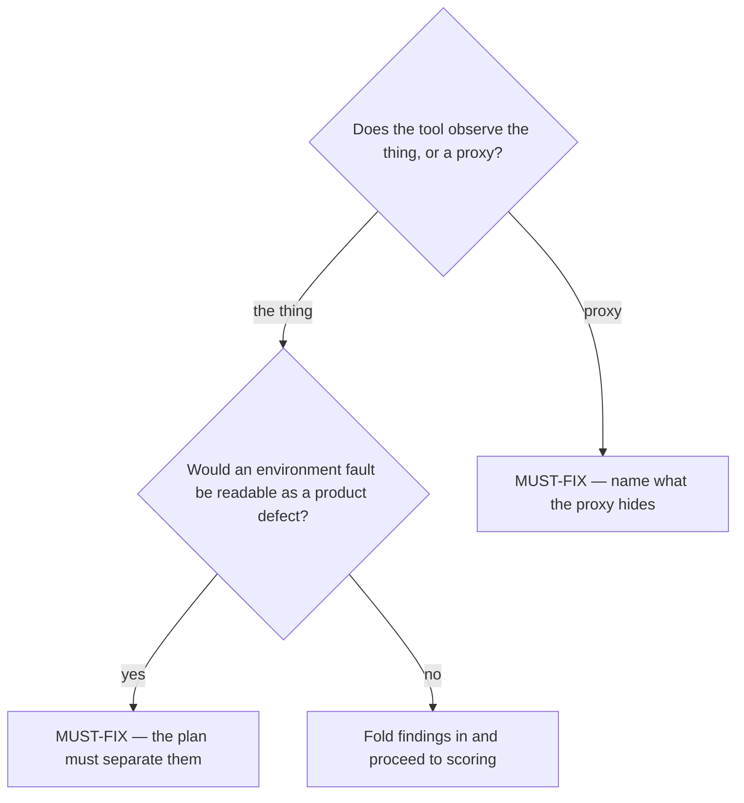

# Find what would make the measurement lie

## Purpose

Surface the failure modes of the MEASUREMENT, not of the system: the ways this plan could return a clean number that means nothing.

## Prerequisites

- A measurement plan exists — this is phase 2 and `/discover-plan` is phase 1.
- The plan names its tools and targets, because those are what can lie.

## Steps

1. Run `/discover-edge-cases {slug}`.
2. Check each target for staleness: resolving is not the same as current.
3. Ask, for each question, whether the tool observes the thing or a proxy for it.
4. Separate an environment fault from a product defect for every failure the plan could see.
5. Fold the MUST-FIX findings back into the plan before scoring it.

## Decisions

| Finding class | What it means | What follows |
|---|---|---|
| MUST-FIX | The measurement would lie in a way that changes the conclusion | Fix the plan; do not run it |
| SHOULD-TEST | A real risk that does not invalidate the result | Fold in if cheap |
| DOCUMENT | A known limit of the method | Record it in the plan |

## Escalation

- The only available tool observes a proxy and no better one exists → record it as a stated limit rather than dropping it. → the plan carries the caveat into the opportunity.
- An edge case implies a wider investigation → refuse it. → an edge case lives inside what was planned; a wider question is a new item.

## Competencies

- Distinguishing a measurement that fails from one that lies. The first is visible; the second is the reason this phase exists.
- Refusing speculation about future states. The system that exists is the one being measured.
