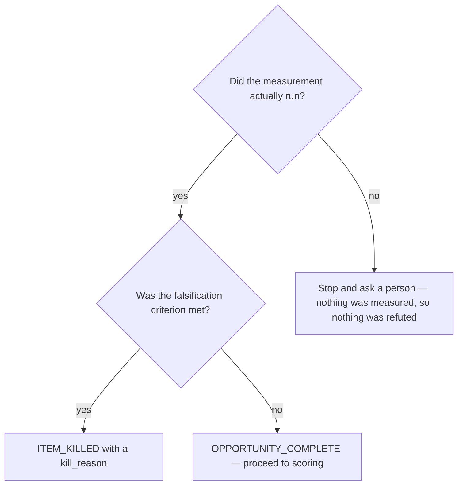

# Run the measurement

## Purpose

Turn a plan into evidence about OUR system, and accept the outcome the evidence gives — including the one where the item dies.

## Prerequisites

- The plan scored well enough to run.
- The mode is decided — review, live-test, bug or evolve — because the mode fixes what counts as evidence.
- Write access is NOT needed. Discover produces a document.

## Steps

1. Run `/discover-execute {slug}`.
2. Record each answer against the question that asked for it, with the pointer that supports it.
3. Populate all four corners: evidence, constraint relation, blast radius, verification. Answer the constraint corner `unknown` when that is honest.
4. Emit `ITEM_KILLED` with a `kill_reason` when the falsification criterion is met. That is a successful outcome of this cycle, not a failure of it.
5. Stop and ask a person when the measurement could not be RUN at all — an unreachable target refuted nothing.

## Decisions

| Outcome | What it means | What follows |
|---|---|---|
| `OPPORTUNITY_COMPLETE` | Every question answered or blocked with a reason; all four corners populated | `/discover-confidence` |
| `ITEM_KILLED` | The falsification criterion was met | The item closes with its `kill_reason`. Nothing further |
| `OPPORTUNITY_BLOCKED` | The run stopped on something it could not pass | Surface the blocker; the item stays open |
| Measurement could not run | Target unreachable, credential absent, tool missing | Stop and ask a person. Never `ITEM_KILLED` |

## Escalation

- The measurement wants a change to a governed repo → refuse. → an opportunity carrying the patch has pre-empted the plan cycle and skipped every gate after it.
- A pointer cannot be produced for a claim → drop the claim. → fabricated evidence is a plausible pointer nobody opened.
- The tool is missing on this machine → the run did not happen. → whoever owns the environment.

## Competencies

- Treating a kill as a result. A run that measures honestly and finds nothing has protected the plan cycle from work justified by a hunch.
- Never substituting a weaker measurement for the one that could not run, and never reasoning about what it would probably have shown.
