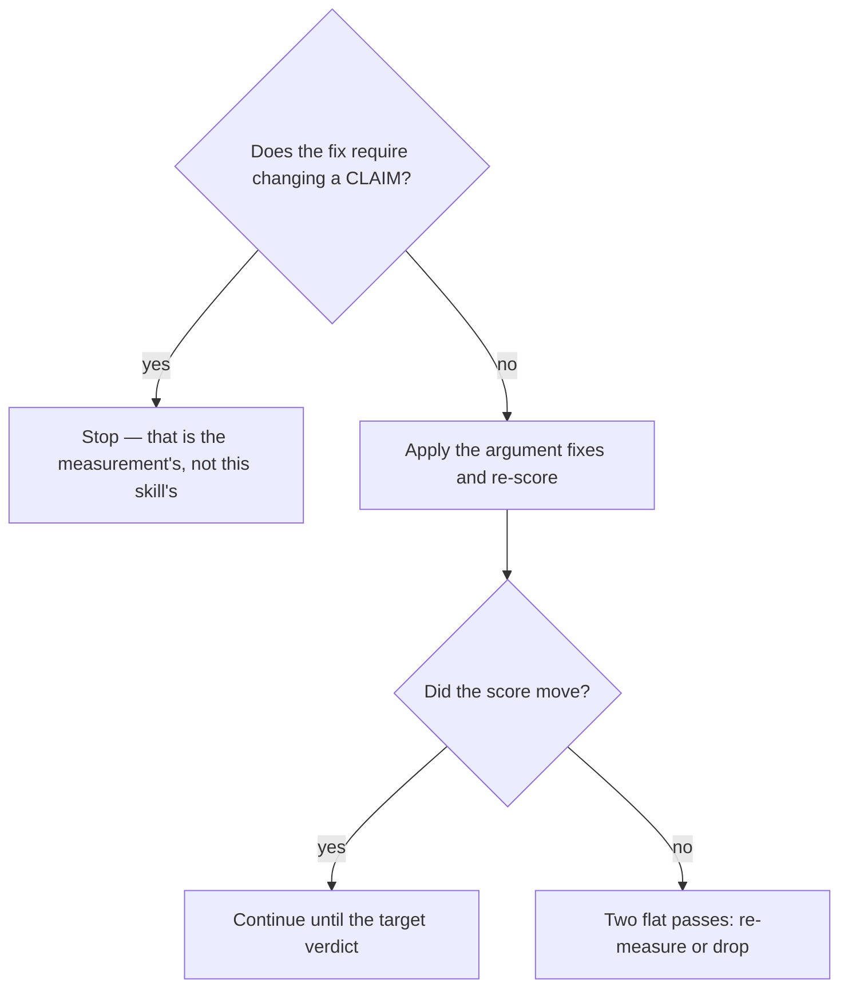

# Improve how an opportunity is argued

## Purpose

Salvage a finding whose case is weak, without touching the measurement that produced it.

## Prerequisites

- `/discover-confidence` returned `NEEDS_REVISION`.
- The Evidence corner is intact — this procedure must leave it that way.

## Steps

1. Run `/discover-improve {slug}`.
2. Improve structure, completeness and the explicitness of the reasoning.
3. Leave the Evidence corner untouched. Editing it falsifies findings, and downstream cannot tell.
4. Re-score with `/discover-confidence`.
5. Stop when the target verdict is reached, or when two passes change nothing.

## Decisions

| Result | What it means | What follows |
|---|---|---|
| Target verdict reached | The case is now made | Proceed to `/to-plan` |
| No improvement across two passes | The weakness is in the measurement, not the writing | Re-measure or drop the item |
| A cap requires changing a claim | Out of scope for this skill | Stop; the claim is the measurement's |

## Escalation

- An unresolvable pointer tempts an annotation → refuse. → annotating it disarms `fabricated_evidence`, which is why the capability was removed.
- The finding cannot be argued without new evidence → this is not an improvement task. → back to `/discover-execute`.

## Competencies

- Holding the line between HOW something is argued and WHAT it claims.
- Recognising a flat score as information: the writing was never the problem.
