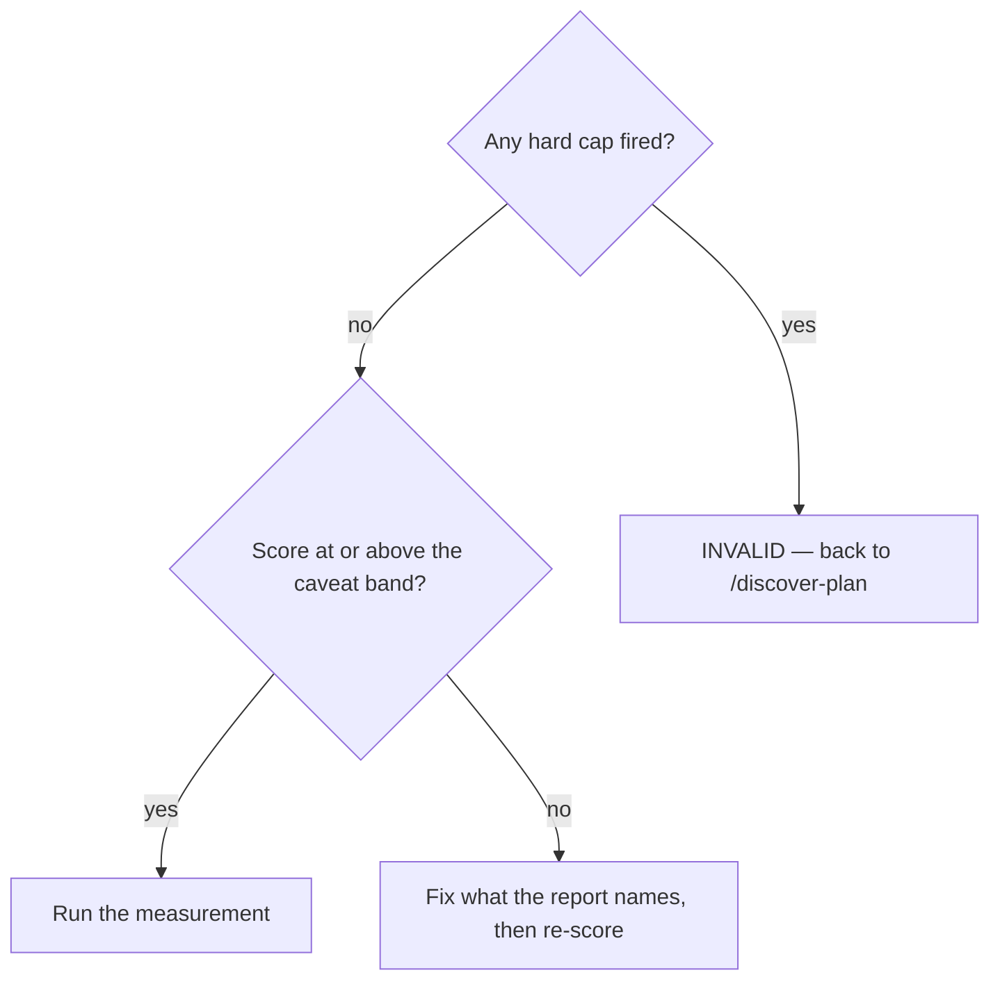

# Score the measurement plan

## Purpose

Decide whether a plan is ready to run, deterministically and in under five seconds, so that a weak plan is caught before it consumes a measurement.

## Prerequisites

- `/discover-edge-cases` has run and its MUST-FIX items are folded in.
- The plan is on disk where the scorer can read it.

## Steps

1. Run `/discover-plan-confidence {slug}`.
2. Read the verdict and the hard caps that fired, not the number alone.
3. Route on the verdict per Decisions below.
4. Re-score after any edit. A score describes the plan that was read, not the one on disk now.

## Decisions

| Verdict | Band | What follows |
|---|---|---|
| `SHIPPABLE` | ≥ 90 | Run the measurement |
| `SHIPPABLE_WITH_CAVEATS` | ≥ 70 | Run it; the caveats travel |
| `NEEDS_REVISION` | ≥ 50 | Soft caps fired — fix and re-score |
| `NON_SHIPPABLE` | < 50 | Rewrite the plan |
| `INVALID` | hard cap | A structural defect: a fabricated target, an empty corner. Back to `/discover-plan` |

## Escalation

- The rubric looks wrong for this item → do not lower a cap. → an ADR signed by the project owner is the only path, and there is no bypass flag by construction.
- The score seems unfair but every finding is correct → the plan is weak in a way that is worth fixing. → fix it.

## Competencies

- Reading a hard cap as a structural claim, not a severity opinion. A fabricated target is not a small problem with a low score.
- Knowing that no `--skip-checks` or `--force` exists here, and that its absence is a constructor invariant rather than an oversight.
