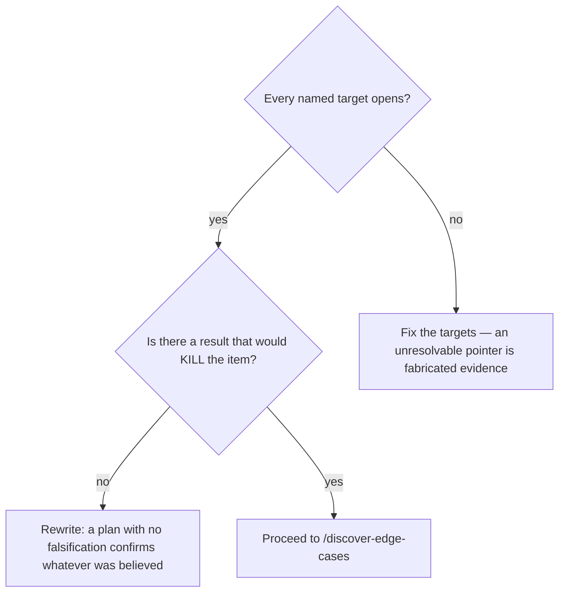

# Write the measurement plan for an item

## Purpose

Produce a measurement plan for one item: the questions, the tool and target for each, and the falsification criterion that would end the item instead of confirming it.

## Prerequisites

- An item exists in `BACKLOG.md` with status `raw`.
- The item's `domain` and `repo` resolve — a plan for an unrouted item measures nothing anyone owns.
- Read access to the target the plan will name. Naming a target without opening it is the single most common source of fabricated evidence downstream.

## Steps

1. Run `/discover-plan {slug}`.
2. Open every target the plan names, before the plan is written down. A path that does not resolve now will not resolve for the measurement either.
3. Write the falsification criterion first, and make it something the run could actually produce.
4. Confirm each question names a tool AND a target. A question with neither is a wish.
5. Hand the plan to `/discover-edge-cases` — never straight to `/discover-execute`.

## Decisions

| State | What it means | What follows |
|---|---|---|
| Plan written, all four corners have a question | The measurement is specified | `/discover-edge-cases` |
| A corner has no question and no `<!-- DEFER-CORNER -->` marker | The plan is incomplete, not minimal | Fill it or defer it explicitly |
| No falsification criterion | The measurement can only confirm | Rewrite before proceeding |

## Escalation

- The target lives in a system nobody here owns → the item is not measurable from this repository. → say so and let the registry record it, rather than measuring a proxy.
- The hypothesis cannot be phrased so that anything refutes it → return it to intake. → whoever filed it; an unfalsifiable item never closes.

## Competencies

- Writing a falsification criterion that the run can actually produce, rather than one nobody could ever meet.
- Telling a target apart from a guess about a target: the difference is whether it was opened.
- Resisting "let's look around and see what we find" — with no plan the measurement confirms whatever was already believed.
