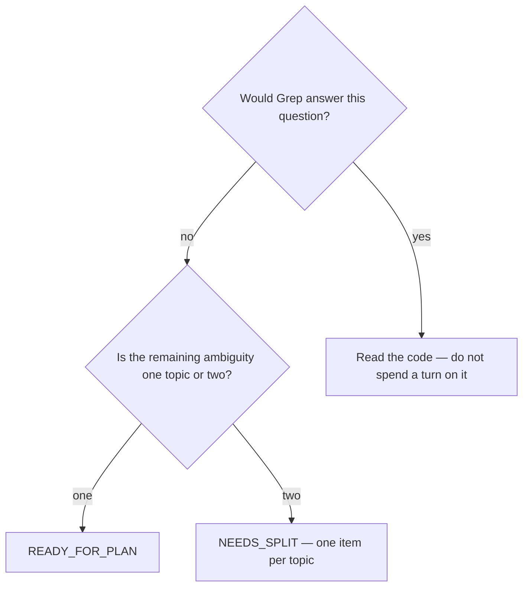

# Grill the requirements before planning

## Purpose

Reach precise requirements for a non-trivial topic, by asking a person only what a person can answer.

## Prerequisites

- The topic is non-trivial AND the requirements are not yet precise. Both, or skip this phase.
- Read access to the repository, because most candidate questions are already answered there.

## Steps

1. Run `/grill-me {slug}`.
2. Search the codebase for every candidate question before asking it. Ask only what needs intent, preference or business context.
3. Ask one question per turn. A turn with `Q1` and `Q2` gets one answer and loses the other.
4. Offer a recommended answer with each question, and stay under fifteen questions.
5. Declare a verdict and stop.

## Decisions

| Verdict | What it means | What follows |
|---|---|---|
| `READY_FOR_PLAN` | The requirements are precise | `/shared-understanding` |
| `NEEDS_SPLIT` | The topic is two topics | Split and re-grill each |
| `NEEDS_DISCOVERY` | The question is empirical, not a preference | Back to `/discover-plan` |

## Escalation

- Fifteen questions is not enough → the topic is too large for one grill. → split it.
- The answer requires a measurement nobody has → `NEEDS_DISCOVERY`. → back to the discover cycle; a preference cannot settle an empirical question.

## Competencies

- Knowing which questions the repository already answers. Asking those spends a person's turn on something a Grep would have closed.
- Keeping one question per turn even when two seem related.
