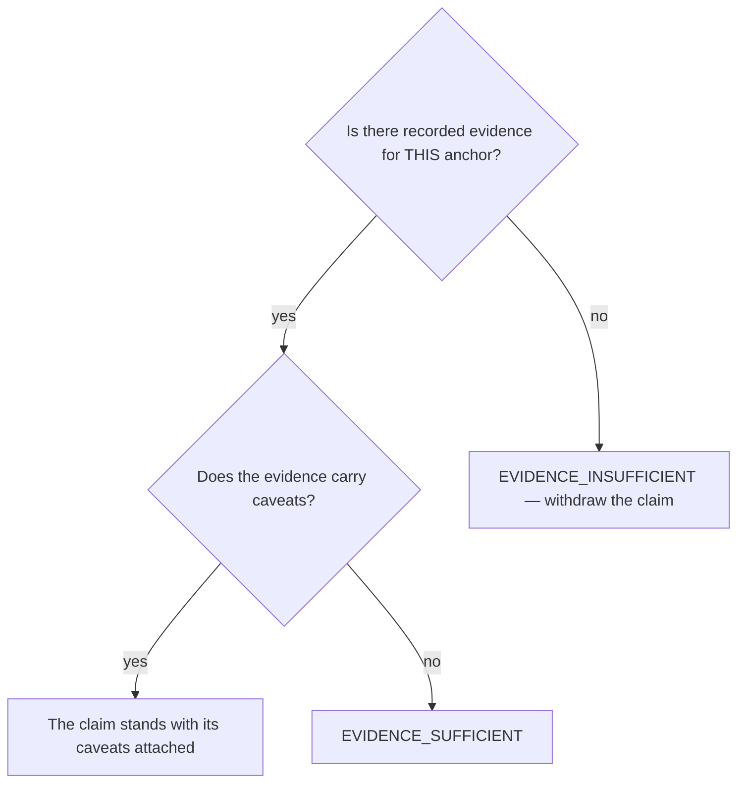

# Gate a production-readiness claim

## Purpose

Make a maturity claim answerable to evidence rather than to confidence.

## Prerequisites

- A manifest exists at `.squad/records/honesty-gate/manifest.md` naming the anchors.
- Evidence files exist for the anchors being claimed.

## Steps

1. Run `/honesty-gate`.
2. Read the verdict per anchor, not in aggregate.
3. Read the caveats when the verdict carries them. They are explicit for a reason.
4. Withdraw or qualify the claim when the evidence does not support it.

## Decisions

| Verdict | What it means | What follows |
|---|---|---|
| `EVIDENCE_SUFFICIENT` | Sustained internal use is recorded for this anchor | The claim may stand |
| `EVIDENCE_WITH_CAVEATS` | Evidence exists and is qualified | Read the caveats; the claim carries them |
| `EVIDENCE_INSUFFICIENT` | No recorded use supports it | The claim does not stand |

## Escalation

- Evidence exists for a different scenario → it does not transfer. → gather it for the anchor being claimed.
- The claim is needed for an external commitment → that is a reason to gather evidence, not to grade it up.

## Competencies

- Reading `EVIDENCE_WITH_CAVEATS` as itself, not as a softer pass.
- Refusing to substitute one scenario's evidence for another's.
