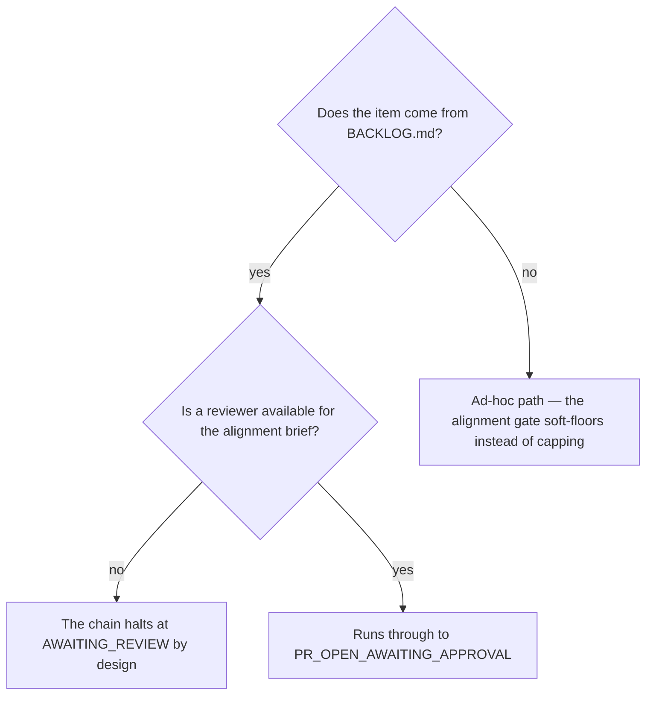

# Take one item from idea to release

## Purpose

Run DISCOVER through ACCEPTANCE for one item without invoking nine commands by hand, and halt where the chain is designed to halt.

## Prerequisites

- The item exists in `BACKLOG.md`.
- The alignment gate can be satisfied — for a backlog item that means a reviewer will be available, because the chain cannot align an item with itself.

## Steps

1. Run `/idea-to-release {item}`.
2. Let the depth be derived from the confidence score. Never assert a confidence signal — the script is deterministic and its output is the truth.
3. Let every gate run. `/plan-edge-cases`, `/deps-audit` and `/code-quality` are cheap and catch what unit tests miss.
4. Expect the chain to stop at `AWAITING_REVIEW` for anything from the backlog. That halt is the design.
5. Read the final verdict and act on it per Decisions.

## Decisions

| Verdict | What it means | What follows |
|---|---|---|
| `PR_OPEN_AWAITING_APPROVAL` | The chain ran to the end | A person merges. The queue moves on |
| `AWAITING_REVIEW` | The alignment gate needs a human tick | Ask for the review; the chain cannot clear this itself |
| `BLOCKED` | A gate stopped on something the chain cannot pass | Read the report; register the causes as items |
| `ITEM_KILLED` | Discover refuted the hypothesis | A successful outcome. Nothing further |

## Escalation

- The chain halts at a gate nobody can clear → register the cause as its own item and take the next one. → one item waiting is not the backlog waiting.
- A gate fails on something this slice did not cause → register each cause and mark this item blocked on them. → `rules/autonomy-envelope.md`.

## Competencies

- Recognising `AWAITING_REVIEW` as a designed stop rather than a failure. A chain that could align an item with itself would be the failure the gate prevents.
- Never skipping a gate on "high confidence". Confidence sets depth, not whether the gates run.
