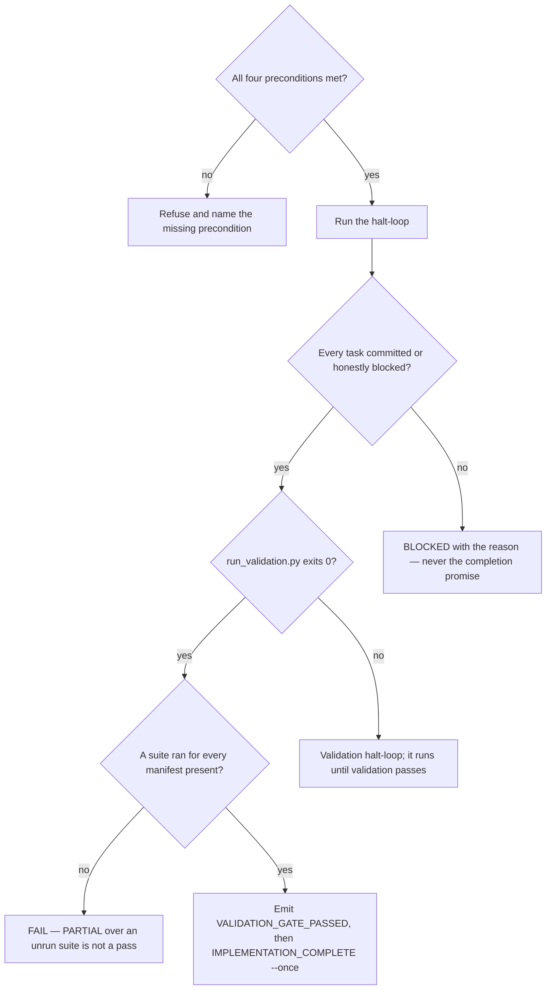

# Execute a plan through the implement halt-loop

## Purpose

Turn a plan into committed work with the tests that prove it, under TDD and the
wiring triad, and end with a validation gate that actually passed rather than one
that was reported as passing.

## Prerequisites

Every one of these is refused rather than warned about. If one fails, the phase
does not start and the missing item is surfaced.

- A plan at `records/plans/{slug}-plan.md` with verdict **≥ `SHIPPABLE_WITH_CAVEATS`**.
- The item scored `ALIGNED` — machine score ≥ 90% **and** every `## Reviewer
  sign-off` box ticked. `AWAITING_REVIEW` is not a pass, and no agent may tick a box.
- The repository is on `workspace`. Never `develop`, never `main`.
- The language toolchain is bootstrapped — a manifest the suite runners can find.
- **The item's domain routes to a specialist that exists on disk.** `route_domain.py`
  exit 3 (`BROKEN ROUTE`) halts the phase: the skill consults the project's specialist
  and never stands in for one nobody wrote. A plan with no `B-NNN` has nothing to route
  on and records a skip instead — that case is expected, not a failure.

## Steps

1. Confirm the four preconditions above before invoking anything. A refusal here
   costs a minute; a refusal three phases later costs the work.
2. Run `/implement {slug}`.
3. Watch the halt-loop close each task: RED must fail first, GREEN must pass,
   REFACTOR happens. Never accept a task marked done without the wiring triad —
   a caller, an integration test and a runtime metric.
4. Read the mini review at each `## Phase N` boundary. `PHASE_REVIEW_NEEDS_FIX`
   halts the loop; fix, then resume — do not restart from the top.
5. Read `run_validation.py {slug}`'s exit code, not its prose. `0` is the only
   value that permits `VALIDATION_GATE_PASSED`.
6. Confirm a suite actually ran. `PARTIAL` exits `0`, and a repository with a
   manifest whose suite never executed must FAIL rather than pass quietly.
7. Emit `IMPLEMENTATION_COMPLETE` with `--once`. This phase concludes; it does
   not iterate, and without the flag the milestone has been written twice for one
   item, seconds apart.

## Decisions

## Escalation

- A gate fails on a cause this slice did not create → register each cause as its
  own item and mark this one blocked on them. → the queue works the causes; see
  `rules/autonomy-envelope.md`.
- The plan turns out to be wrong once code meets reality → stop and return to
  `/plan-write`. → never widen an item that is already executing; the excess becomes
  new items, linked.
- Context runs out mid-loop → **not** a valid halt reason. The halt-loop exists to
  span context boundaries; let it restart. → nobody.
- A test is failing and the quickest way forward is to weaken it → stop. →
  whoever owns the behaviour that test protects.

## Competencies

- Reading an exit code as the claim, and prose as commentary. `PARTIAL` exits `0`,
  which is exactly how a repository with no test run once reached a green gate.
- Telling an honest `BLOCKED` from a convenient one. A blocked task names what
  stopped it; a completion promise emitted from a partial state is the one failure
  no downstream gate can catch.
- Recognising the four forbidden shortcuts as the same act: disabling a failing
  test, lowering a coverage threshold, a no-op caller that satisfies the wiring
  triad, and a hand-edited `.wiring-evidence.json`.
- Knowing that `--once` is a claim about the KIND of event, not a convenience:
  a phase that concludes is recorded once, a gate that iterates is recorded every
  time it runs, and the emitter cannot tell them apart.
