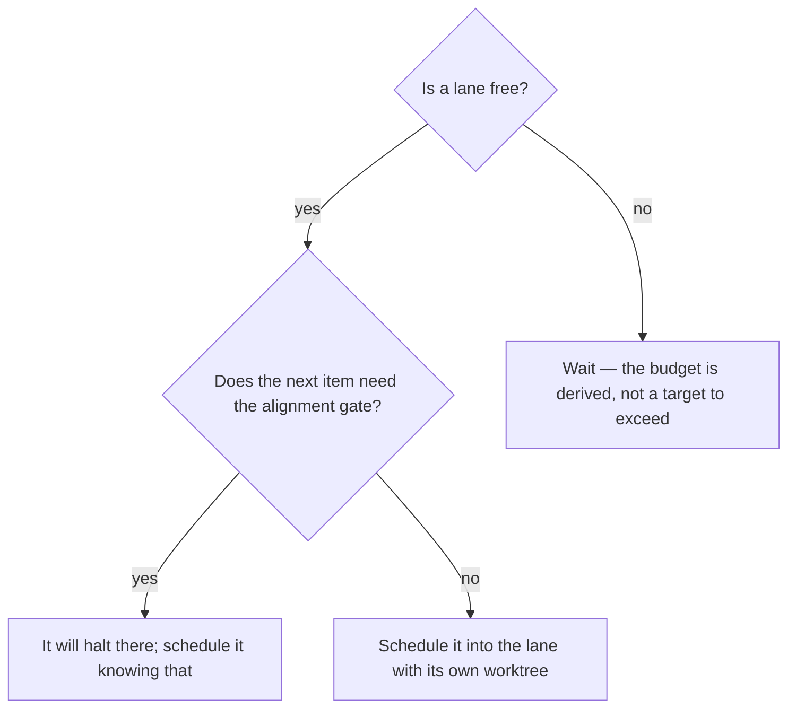

# Run many items through the cycle at once

## Purpose

Move many items through the same chain in parallel, without any item skipping a gate it would have faced alone.

## Prerequisites

- Several items are `triaged` and selectable.
- The machine has the cores the lane budget assumes: lanes are derived, never asserted.
- Every gate the chain declares still applies per item — confirm you are not expecting the pipeline to relax one.

## Steps

1. Run `/pipeline` with the items to schedule.
2. Let the lane budget be derived from the cores available minus the review fan-out. An asserted number deadlocks on its own limit.
3. Confirm each lane has its own worktree. Concurrent stages cannot share a tree.
4. Let a blocked item free its lane and record the impediment, rather than holding the lane.
5. Read the status writes back to `BACKLOG.md` — the disk is the only copy that outlives the session.

## Decisions

| State | What it means | What follows |
|---|---|---|
| Lane completes a stage | The item advances one stage | The next item enters the freed lane |
| Item blocked | The impediment is recorded and the lane freed | The queue works the cause |
| Item sent back | A downstream stage returned a commit, not a task | The item re-enters at the earlier stage |
| Alignment gate reached | The pipeline cannot satisfy it | That item waits; the others move |

## Escalation

- Every candidate is blocked → the queue has a wall, not an empty backlog. → attack the causes; adding items beside a wall is motion.
- A lane's worktree conflicts → isolation failed, and findings from a shared tree cannot be trusted. → stop that lane rather than reading its output.

## Competencies

- Knowing the pipeline schedules and never judges. It decides which item enters which stage, never whether a stage passed.
- Reading a derived lane budget as a ceiling that was measured, not a preference.
