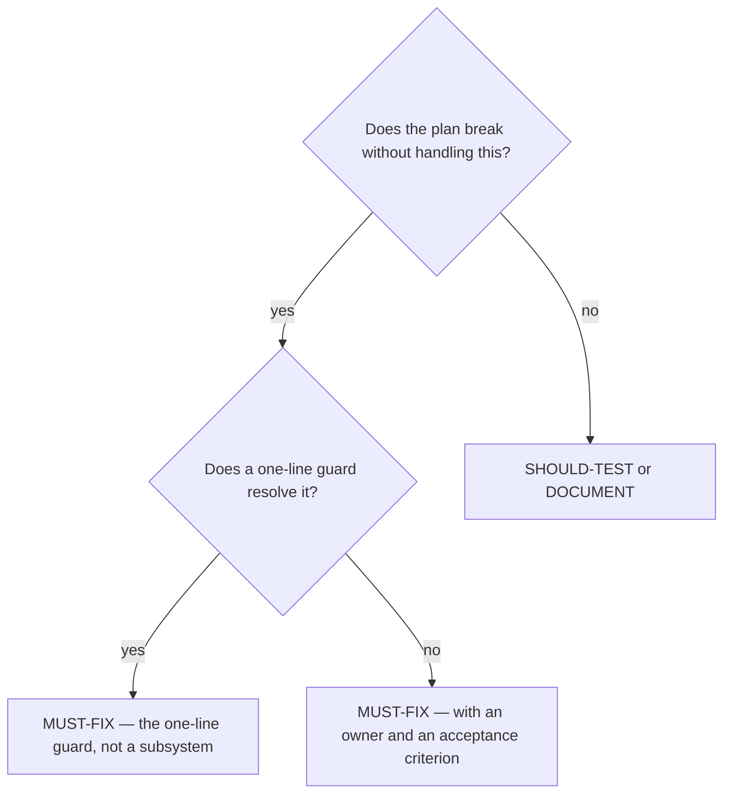

# Find the edge cases a plan does not handle

## Purpose

Surface real risks inside the plan as written, and get the MUST-FIX ones absorbed before it is scored.

## Prerequisites

- A plan exists at `records/plans/{slug}-plan.md`.
- `/plan-write` has finished — this is phase 2 and that is phase 1.

## Steps

1. Run `/plan-edge-cases {slug}`.
2. Analyse the plan AS IT IS. A future API change is not an edge case of this plan.
3. Classify each finding MUST-FIX, SHOULD-TEST or DOCUMENT.
4. Give every MUST-FIX an owner and an acceptance criterion.
5. Absorb the MUST-FIX items into the plan before `/deps-audit`.

## Decisions

| Class | What it means | What follows |
|---|---|---|
| MUST-FIX | The plan is wrong without it | Absorbed into the plan, with an acceptance criterion |
| SHOULD-TEST | A real risk worth a test | Added to the test plan |
| DOCUMENT | A known limit | Recorded, not built around |

## Escalation

- The fix wants a new abstraction → refuse. → `if input.is_empty()` solves it; an `ErrorRecoveryManager` is the anti-pattern this phase names.
- The edge case implies the plan is wrong at the goal level → back to `/plan-write`. → this phase annotates plans, it does not rewrite them.

## Competencies

- Telling an edge case from a wider investigation. The first lives inside what was planned.
- Preferring the smallest guard that closes the case over the most general one.
