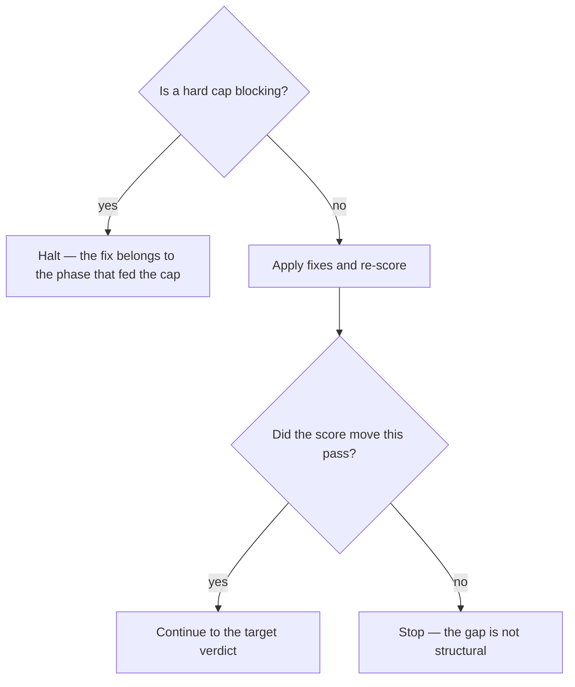

# Improve a plan until it clears its band

## Purpose

Raise a plan's score to at least `SHIPPABLE_WITH_CAVEATS` without changing what the plan promises.

## Prerequisites

- `/plan-confidence` returned a verdict below `SHIPPABLE_WITH_CAVEATS`.
- The plan file is the only thing that needs to change. If the fix is elsewhere, this is the wrong skill.

## Steps

1. Run `/plan-improve {slug}`.
2. Let Phase A apply the deterministic fixes, then Phase B the semantic ones.
3. Re-score with `/plan-confidence` after each pass.
4. Stop when the target verdict is reached, or when a pass changes nothing.
5. Halt on a hard-cap blocker rather than iterating against it.

## Decisions

| Result | What it means | What follows |
|---|---|---|
| Target verdict reached | The plan clears its band | `/implement` |
| No improvement in a pass | The remaining gap is not structural | Stop; return to `/to-plan` |
| A hard cap is blocking | Another phase owns the fix | Halt and route there |

## Escalation

- The score will not move and the plan reads fine → the weakness is in the goal, not the writing. → back to `/to-plan`.
- A fix would require a file outside the plan → out of scope by contract. → this skill never touches anything else and never commits.

## Competencies

- Recognising a flat pass as information rather than as a reason to try harder.
- Never fabricating an ADR alternative to satisfy a rubric row.
