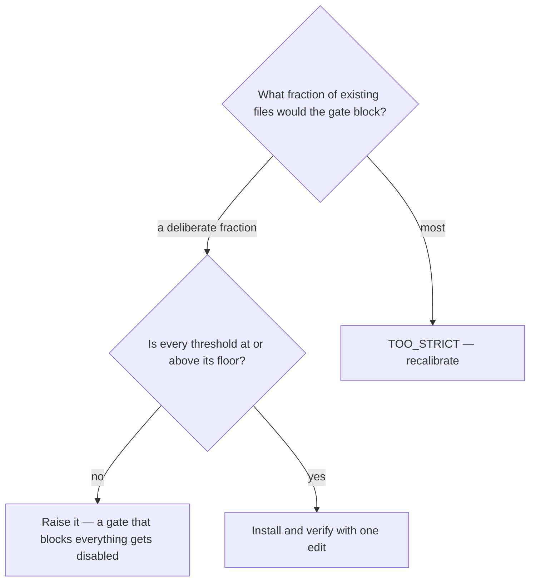

# Calibrate the quality-gate hooks for a project

## Purpose

Give a project quality gates it can actually pass on day one, and know how much of the existing code they would block.

## Prerequisites

- The project has code to measure. Calibration on an empty tree measures nothing.
- The languages and their test directories are discoverable.

## Steps

1. Run `/quality-init {target}`.
2. Read the calibration stage: how much of the existing code the generated gate would block.
3. Confirm no threshold sits below its floor — a gate that blocks every write makes the assistant unusable.
4. Install the hooks and verify one edit passes.

## Decisions

| Verdict | What it means | What follows |
|---|---|---|
| `READY` | The gate blocks a small, deliberate fraction | Install |
| `REVIEW` | It would block enough to be worth a decision | Decide with the number in front of you |
| `TOO_STRICT` | It would block most of the tree | Recalibrate before installing |

## Escalation

- The calibrated gate would block half the tree → that is a decision, not a default. → whoever owns the codebase decides between fixing and relaxing.

## Competencies

- Reading a per-metric p90 as a per-file risk: thirty functions in a file are thirty chances of holding one of the worst ten percent.
- Knowing hooks are gates, never fixers.
