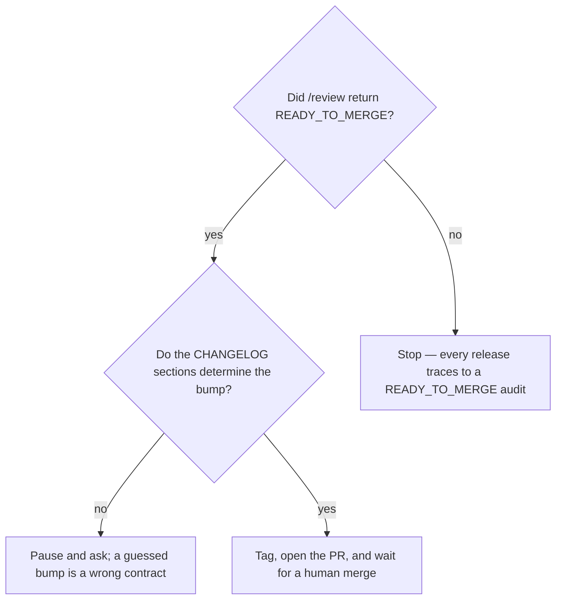

# Cut a release

## Purpose

Turn reviewed work into a tagged release proposal, with notes rendered from the CHANGELOG rather than from git log.

## Prerequisites

- `/review` returned `READY_TO_MERGE`.
- `[Unreleased]` in the CHANGELOG describes the change for a consumer, not for a developer.
- The branch flow is respected: the release is cut from `develop`, never from `workspace` or `main`.

## Steps

1. Run `/release {bump}`.
2. Confirm the version derived from the CHANGELOG sections matches what the change actually is.
3. Review the rendered notes before the PR opens.
4. Open the `develop → main` PR and stop.
5. Wait for a person to merge. Create the annotated tag and the GitHub release only after the merge.

## Decisions

| State | What it means | What follows |
|---|---|---|
| `PR_OPEN_AWAITING_APPROVAL` | The proposal is complete | Wait. This is the correct end state for the phase |
| Version ambiguous | `[Unreleased]` has only `Changed` under 0.x | Pause and carry the question; do not guess minor versus patch |
| `[Unreleased]` empty | Nothing to announce | There is no release to cut |

## Escalation

- The PR is open and nobody merges → that is the design, not a stall. → the queue moves to the next item; the PR is the record.
- The bump cannot be derived → carry the question to a person. → guessing minor versus patch under 0.x misstates compatibility.

## Competencies

- Never auto-merging. It is the single act that reaches shared history and it stays outside the envelope.
- Writing CHANGELOG entries for the consumer rather than the developer, because the release notes are rendered from them.
