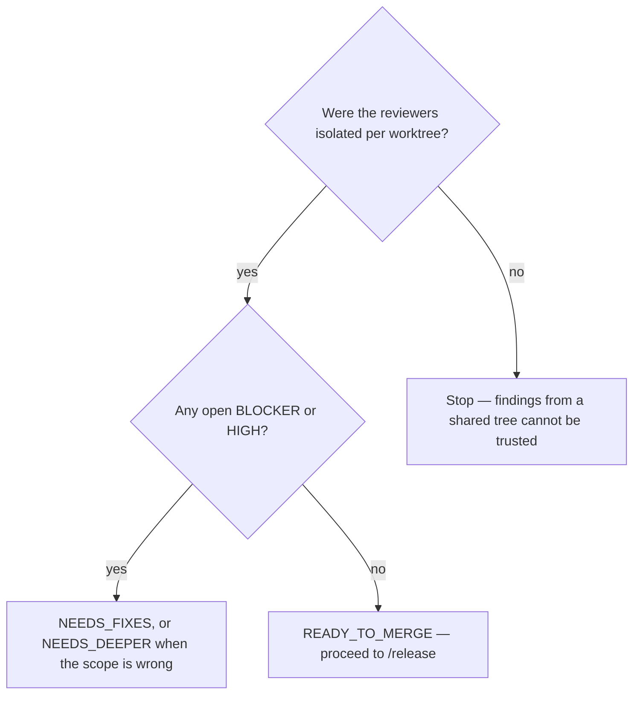

# Run the review gate

## Purpose

Compare the diff against the plan line by line, across the dimensions the domain needs, and produce a verdict the release phase can act on.

## Prerequisites

- `/implement` validation passed, or its PARTIAL is documented and permitted for this lifecycle stage.
- `/code-quality` has run.
- The plan is on disk — it is what the diff is compared against.

## Steps

1. Run `/review {slug}`.
2. Confirm the reviewers were spawned with `isolation="worktree"`. Six reviewers in one tree produced a false BLOCKER against a symbol that existed.
3. Read the consolidated report, not the individual agents' output.
4. Route the verdict per Decisions below.
5. Re-review after fixes. A verdict describes the diff that was read.

## Decisions

| Verdict | What it means | What follows |
|---|---|---|
| `READY_TO_MERGE` | No open BLOCKER or HIGH finding | `/release` |
| `NEEDS_FIXES` | Findings to close in this slice | Fix, then re-review |
| `NEEDS_DEEPER` | The slice is wrong at the scope level | Back to `/plan-write` for re-scoping |
| `BLOCKED` | The review could not be performed | Say why; never a PASS by default |

## Escalation

- Review depth needs domain expertise outside the model's reach → mark BLOCKED with that reason. → a human domain expert.
- A finding is disputed → the finding stays open until closed with evidence. → deleting a finding and lowering a BLOCKER to MEDIUM are the same act.

## Competencies

- Knowing that this gate reviews and never merges, and that `NEEDS_DEEPER` is a scope verdict rather than a harder `NEEDS_FIXES`.
- Recognising contamination: a finding about a symbol that plainly exists usually means the tree moved under the reviewer.
