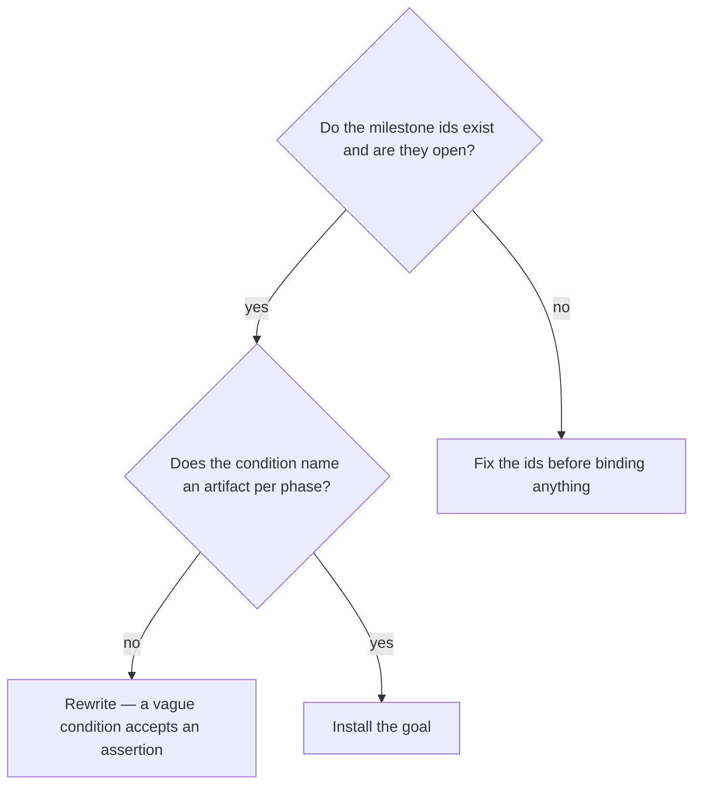

# Bind a session to a milestone

## Purpose

Prevent a session from stopping before acceptance is green, by composing a termination condition a small model can evaluate.

## Prerequisites

- The milestone ids exist in `ROADMAP.md`, are still open, and their dependency order is honoured.
- The acceptance directory resolves inside this project. A goal pointing outside it couples two autonomous repositories.

## Steps

1. Run `/session-goal M{N}`.
2. Name the artifact each phase must produce. "M2 is done" lets the evaluator accept an assertion.
3. Keep the persona out of the goal. It is a Stop-hook condition read by a small model with a cap.
4. Confirm the hook was installed and points inside this project.

## Decisions

| State | What it means | What follows |
|---|---|---|
| Goal installed | The session cannot stop before the condition is met | Work proceeds |
| Milestone already closed | There is nothing to bind | Pick another |
| Dependency order violated | An earlier milestone is still open | Bind that one first |

## Escalation

- The goal would point at an acceptance directory outside this project → refused by `install_goal_hook.py`. → keep each project's records inside it.
- The session cannot finish and the condition is correct → the work is not done. → that is the goal working.

## Competencies

- Writing a stop condition whose single criterion is an artifact on disk rather than a claim in prose.
- Keeping the evaluator's budget in mind: it is a small model with a cap, not a reader.
