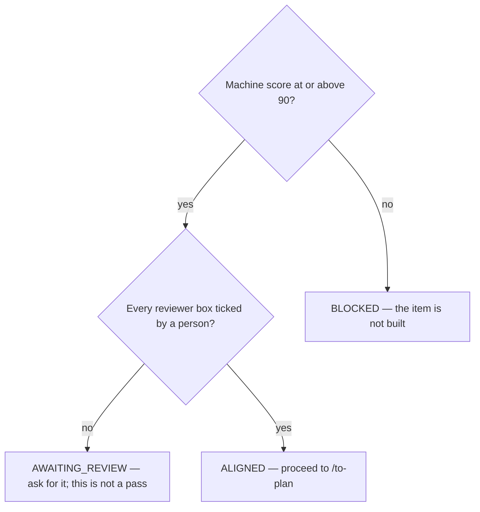

# Bring an item to shared understanding before it is built

## Purpose

Reach ~90% shared understanding of ONE item before any of it is built, and produce the brief and walkthrough that prove it.

## Prerequisites

- `/discover-plan` produced evidence the item is real.
- The item comes from `BACKLOG.md` — for those this phase is unbreakable, not optional.
- A reviewer exists who is not the author of the brief.

## Steps

1. Run `/shared-understanding {slug}`.
2. Grill before drawing. A diagram of a vague brief looks rigorous and is not.
3. Produce the brief and the animated walkthrough in the same pass.
4. Generate the reviewer checklist UNTICKED. Never tick a box.
5. Send it to a reviewer and wait for the verdict.

## Decisions

| Verdict | What it means | What follows |
|---|---|---|
| `ALIGNED` | Machine score ≥ 90% AND every reviewer box ticked | `/to-plan` |
| `AWAITING_REVIEW` | Structure is done; nobody has signed off | Ask for the review. This is not a pass |
| `BLOCKED` | Below the machine threshold | Close the listed gaps and re-score. The item is NOT built |
| `NEEDS_SPLIT` | The brief describes two subsystems | Split into items that each align on their own |

## Escalation

- No reviewer is available → the item waits. → `check_alignment_gate.py` hard-caps an unaligned plan at 49 and there is no `--skip` and no dismissing ADR, because an escape hatch here is an escape hatch on the whole reason the gate exists.
- The brief spans two subsystems → `NEEDS_SPLIT`. → the gaps are a consequence of two items sharing one brief, and no rewrite closes them.

## Competencies

- Never ticking your own review box. The mechanism exists because the first version let the author sign, which is not a review.
- Knowing that `AWAITING_REVIEW` and `ALIGNED` are different claims, and that only one of them lets code be written.
