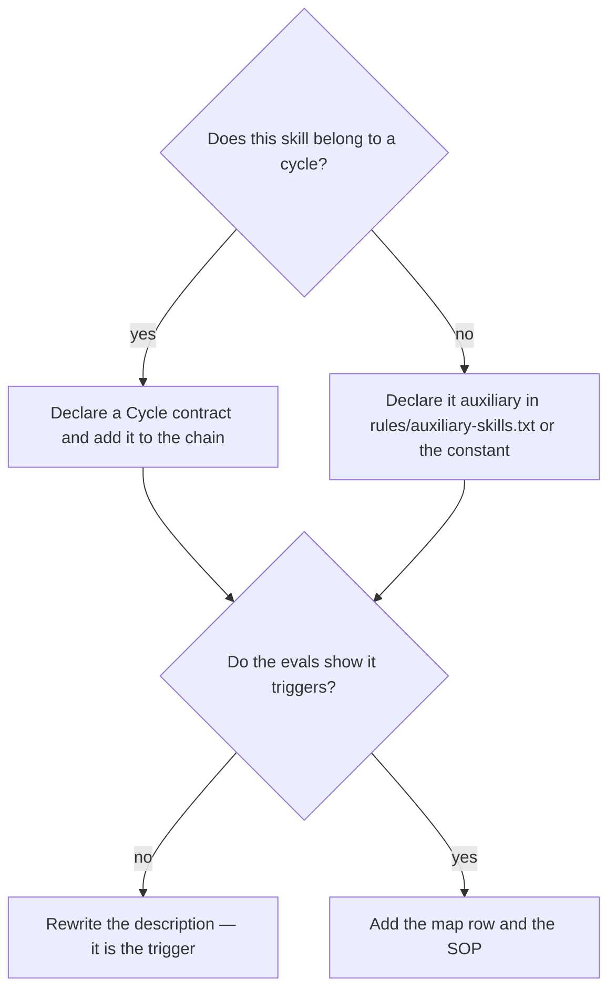

# Author or improve a skill

## Purpose

Produce a skill that triggers when it should, does what it says, and is measured rather than assumed.

## Prerequisites

- The need is real and not covered by an existing skill. Check `skills/map.md` first.
- The skill will live at `skills/{name}/SKILL.md` with the frontmatter the convention requires.

## Steps

1. Run `/skill-creator`.
2. Write the description as a trigger, because discovery reads it.
3. Run the evals rather than assuming the trigger works.
4. Add a `## Cycle contract` when the skill belongs to a cycle, or declare it auxiliary.
5. Add a row to `skills/map.md` and a `SOP.md` beside the skill.
6. Run `check_xrefs.py` and the frontmatter test.

## Decisions

| State | What it means | What follows |
|---|---|---|
| Evals pass, contract declared | The skill is discoverable and placed | Add it to the map |
| No cycle contract and not declared auxiliary | `check_xrefs` reports it orphan | Declare one or the other |
| Not in `map.md` | `check_skill_map.py` fails | Add the row |

## Escalation

- The skill overlaps an existing one → do not ship both. → merge, or state the boundary in each.
- Upstream changed → re-sync is a copy. → never hand-merge this vendored skill.

## Competencies

- Writing a description that triggers, since that is what discovery reads.
- Knowing that a skill nobody can find is a skill that does not exist — the map row is part of shipping it.
