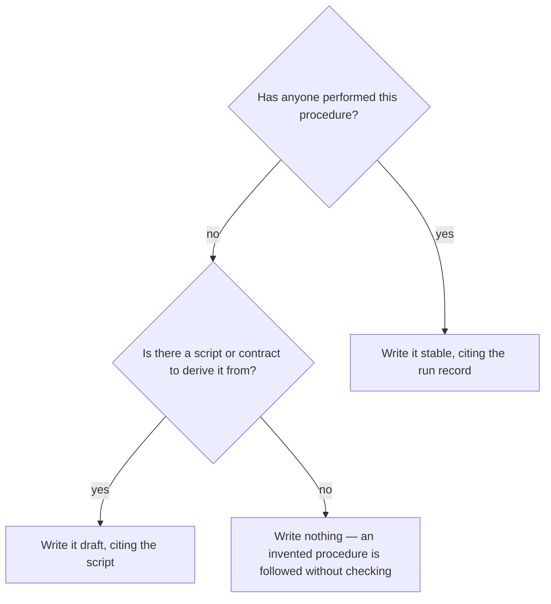

# Write or revise a procedure

## Purpose

Give a repeated act a written procedure with an owner, a review date, and the decisions it actually contains.

## Prerequisites

- The act is repeated. A one-off belongs in a record, not a procedure.
- Someone has performed it, or the source it is derived from is named honestly.

## Steps

1. Run `/sop-author {name}`.
2. Write the steps as imperatives, one action each.
3. Draw the decisions, giving every decision node at least two answers.
4. Name an owner a reader can reach, and route each escalation to someone.
5. Set `status: draft` when the procedure was derived from code rather than from a run somebody performed.

## Decisions

| State | What it means | What follows |
|---|---|---|
| Derived from a performed run | The strongest claim available | `status: stable`, with the run in `sources` |
| Derived from a script | The steps are read, not tested | `status: draft`, and say so |
| Nobody has performed it and no source exists | There is nothing to write yet | Do not invent it |

## Escalation

- The procedure would name a mechanism this project does not have → stop. → that is how a ported fix breaks the receiving side.

## Competencies

- Telling a procedure derived from a run apart from one derived from code, and marking the difference where a reader sees it.
- Writing steps someone can follow without the author present.
