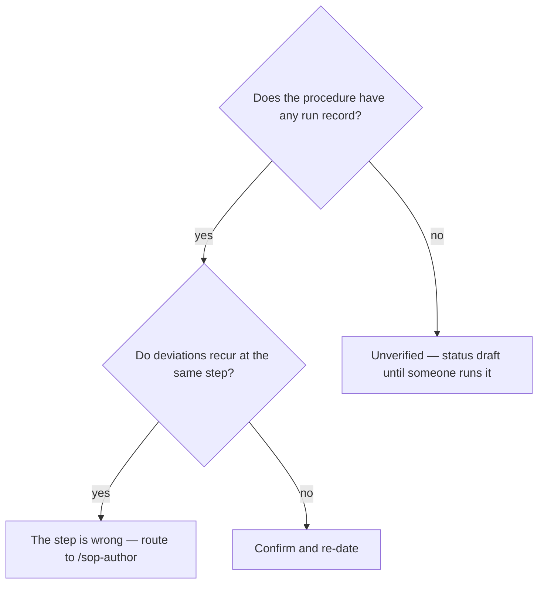

# Review the procedures and their run records

## Purpose

Find the procedures that have stopped describing what people do.

## Prerequisites

- SOPs exist, in the bundle or beside the skills.
- Run records exist where runs happened. Their absence is itself a finding.

## Steps

1. Run `/sop-review`.
2. Read procedures past their review date as stale until someone confirms otherwise.
3. Read a recurring deviation as a defect in the document, not in the operator.
4. Read a procedure with no run at all as unverified, whatever its status says.
5. Route each finding to `/sop-author`; never edit a SOP from here.

## Decisions

| Finding | What it means | What follows |
|---|---|---|
| Past its review date | Nobody has confirmed it recently | Re-read and re-date, or revise |
| Recurring deviation | The document is wrong at that step | `/sop-author` |
| No run record at all | The procedure is unverified | Run it, or mark it draft |
| A competency nobody is verified for | The procedure assumes skill nobody attested | Name it |

## Escalation

- A procedure is stale and its owner has moved on → it has no owner. → assign one or retire it; an unowned procedure is followed by nobody and trusted by everybody.

## Competencies

- Reading a recurring deviation as evidence about the document.
- Holding read-only: a reviewer that fixes what it finds cannot report what it found.
