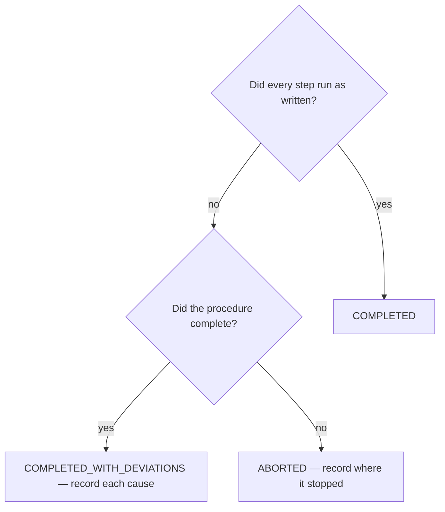

# Execute a procedure and record what happened

## Purpose

Produce the record that makes a procedure improvable: what actually happened, including where it did not match the document.

## Prerequisites

- The SOP exists and you have read it end to end before starting.
- The prerequisites the SOP declares are met, or the deviation is recorded from the first step.

## Steps

1. Run `/sop-run {sop}`.
2. Account for every step: ran, skipped, or adapted.
3. Record each deviation with the condition that forced it. A deviation without its cause teaches nothing.
4. Declare the outcome and leave the run record on disk.

## Decisions

| Outcome | What it means | What follows |
|---|---|---|
| `COMPLETED` | Every step ran as written | Nothing; the procedure held |
| `COMPLETED_WITH_DEVIATIONS` | It worked, and the document was wrong somewhere | Feed the deviations to `/sop-review` |
| `ABORTED` | The procedure could not be completed | Record where and why |

## Escalation

- A step names a mechanism that does not exist here → stop and record it. → the SOP's author; a step nobody can perform is a defect in the document.
- The same deviation happens every run → the document is wrong, not the operator. → `/sop-review` picks up recurring deviations.

## Competencies

- Recording the deviation rather than the tidy version. The deviations are the reason the record exists.
- Never recording a run that did not happen.
