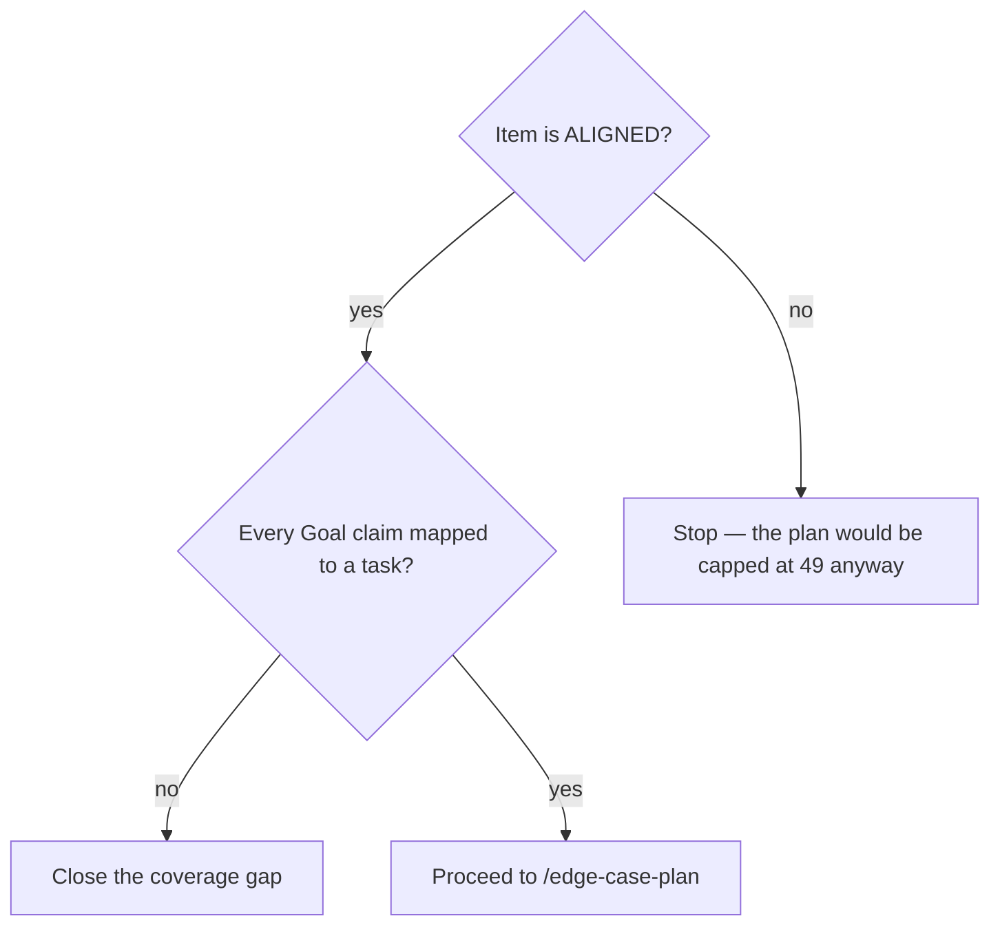

# Write the implementation plan

## Purpose

Produce `records/plans/{slug}-plan.md`: what will be built, in what order, with what proves each part.

## Prerequisites

- The item is `ALIGNED`. A plan written before alignment is capped at 49 and cannot enter `/implement`.
- The grill output, if `/grill-me` ran, is on disk where Step 0 will find it.

## Steps

1. Run `/to-plan "{one-sentence description}"`.
2. Let Step 0 auto-discover the rules and any `*-patterns` skill before writing.
3. Map every Goal claim to at least one task. A coverage matrix with a gap is a promise nothing delivers.
4. Name the public callers of every symbol the plan modifies. Stop and ask when they cannot be identified — half the bugs `/review` catches start with "we did not know X also called this".
5. Chain onward: `/edge-case-plan` → `/deps-audit` → `/plan-confidence`.

## Decisions

| State | What it means | What follows |
|---|---|---|
| Plan written, coverage matrix complete | Every Goal claim has a task | `/edge-case-plan` |
| A Goal claim maps to no task | The plan promises what it does not build | Fix before proceeding |
| Callers of a modified symbol unknown | The blast radius is unmeasured | Stop and ask; do not guess |

## Escalation

- The public callers of a symbol cannot be identified → stop and ask a person. → guessing here is where the expensive review findings come from.
- The plan turns out to need a boundary decision → write the ADR and proceed on it. → `rules/autonomy-envelope.md` covers which tier needs what.

## Competencies

- Reading a coverage matrix as a contract rather than a formality.
- Knowing that this plan is what `/review` will compare the diff against line by line.
