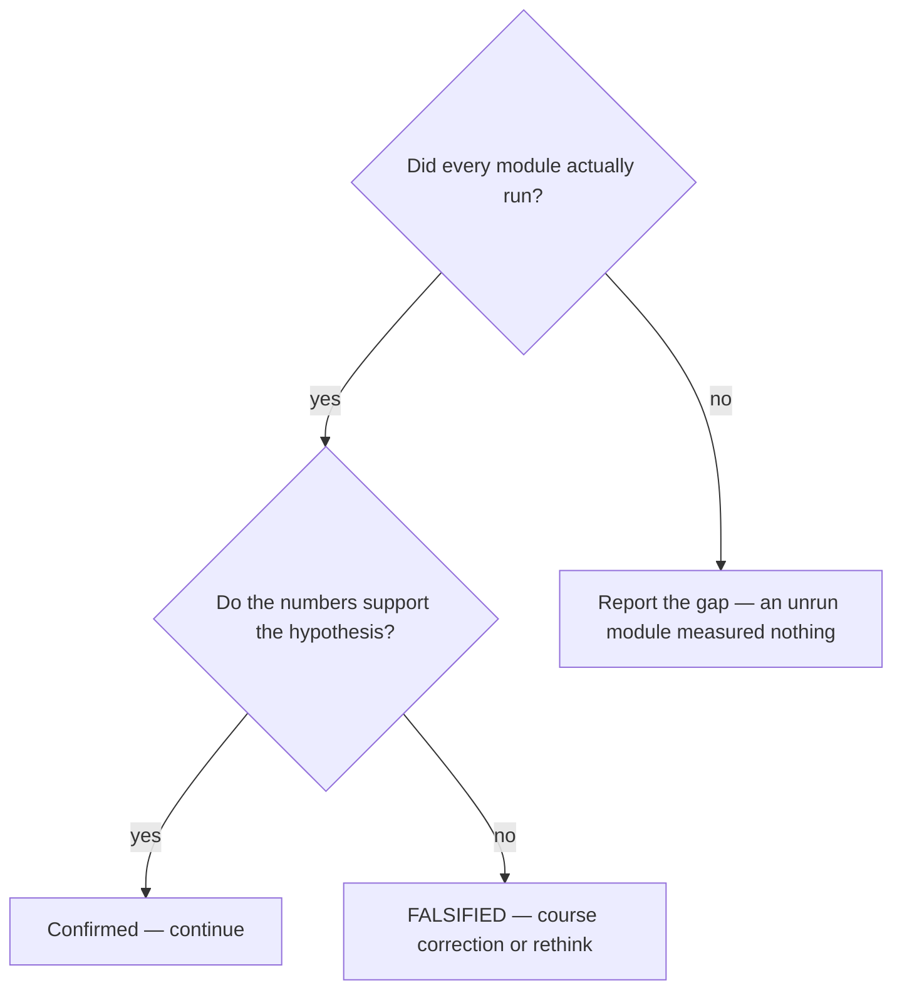

# Validate the trajectory with measurements

## Purpose

Answer whether the project's direction survives measurement, with every number traceable to a tool run.

## Prerequisites

- The project opted in via `rules/trajectory-review-config.txt`. This cycle is opt-in and gates nothing.
- The tools the modules invoke are installed, because a module that could not run measured nothing.

## Steps

1. Run `/trajectory-review`.
2. Extract the hypotheses first. Benchmarks without hypotheses are benchmarking, not review.
3. Let each module produce numbers from an actual tool run with subprocess evidence.
4. Read the verdict as advisory — this cycle is independent and does not gate the chain.

## Decisions

| Verdict | What it means | What follows |
|---|---|---|
| Hypothesis confirmed | The direction survives the measurement | Continue |
| `AT_RISK` | Measurements trend against the hypothesis | Decide deliberately, with the numbers |
| `FALSIFIED` | The hypothesis does not hold | `COURSE_CORRECTION_NEEDED` or a fundamental rethink |
| A module could not run | Nothing was measured | Report that, never a pass |

## Escalation

- A verdict would change the roadmap → this cycle does not gate the chain. → the decision goes to whoever owns the direction, with the numbers attached.
- A tool is unavailable → the module did not run. → whoever owns the environment.

## Competencies

- Refusing to fabricate a measurement. Every number comes from a tool run with subprocess evidence.
- Extracting hypotheses before measuring, so the numbers can answer something.
