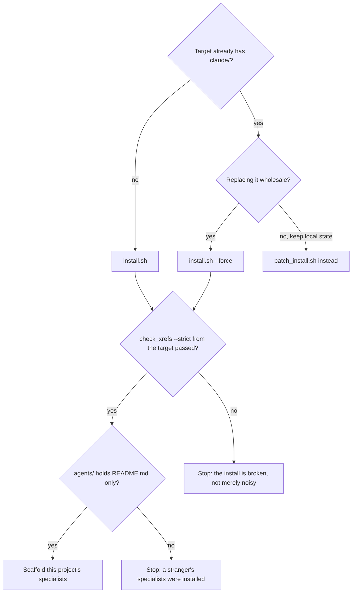

# Install the kit into a consumer

## Purpose

Put the ecosystem into a project that does not have it, as a plugin install at
`<target>/.claude/`, and leave the target in a state where the first cycle can
run. The script does the copying; this procedure is about the parts it cannot
decide and the two ways an install reports success while being broken.

## Prerequisites

- The target exists and is a directory. The script refuses anything else.
- The target has no `.claude/` — or you intend `--force`, which **overwrites**.
- `python3` on the path, because the install validates itself by running
  `check_xrefs.py --strict` from the target.
- A clean working tree in the kit. The installer copies what is on disk, not what
  is committed, so an uncommitted experiment ships with it.

## Steps

1. Run `bash mechanisms/dist/install.sh <target-project-dir>`. Add `--force` only when
   replacing an existing install, and only after reading what it overwrites.
2. Read the validation the installer runs at the end. It executes
   `check_xrefs.py --strict` **from the target**, not from the kit, because a
   validator started from the kit audits the kit — measured on 2026-08-03, three
   consumers reported PASS while carrying 3, 0 and 11 findings.
3. Confirm `.claude/agents/` contains `README.md` and nothing else. The kit ships
   no specialists on purpose: a specialist describes one ecosystem's repositories,
   and installing a stranger's makes the routing gate refuse every item.
4. Derive this project's specialists before routing anything —
   `skills/backlog-init/scripts/scaffold_specialists.py --root <target> --write`.
   Until they exist, `route_domain.py` exits 3 (BROKEN ROUTE) for every domain the
   table names.
5. Point the consumer's own `CLAUDE.md` at `.claude/`. The installer does not
   touch it, by design — it is the consumer's file.
6. Decide whether `.claude/` is tracked. The installer adds nothing to
   `.gitignore`; that is the consumer's call and it has consequences, because a
   fix written inside an untracked `.claude/` protects exactly one machine.
7. Read `.claude/.kit-manifest.txt`. It lists every path the kit brought, so
   anything not in it belongs to the project — the boundary a later patch relies
   on.

## Decisions

## Escalation

- `check_xrefs.py --strict` exits non-zero → stop and read the findings. A clean
  clone once produced an empty `.claude/agents/` and a dangling reference, green
  on the maintainer's machine. → the kit maintainer, not the consumer's owner.
- The target has local improvements under `.claude/` → do not `--force`. → use
  `patch_install.sh`, or the sync classifier, which refuses to overwrite a
  divergence.
- A domain in the routing table has no specialist and the scaffold cannot derive
  one → the topology is wrong, not the install. → whoever owns the repository
  layout.

## Competencies

- Reading a validator's exit code as a claim about a specific target, not about
  wherever the command was typed.
- Telling a scaffold apart from knowledge: an empty directory the installer made
  is not a project that has migrated.
- Knowing which files belong to the consumer — `CLAUDE.md`, `settings.local.json`,
  `records/`, `agents/` beyond the README — and leaving them alone.
