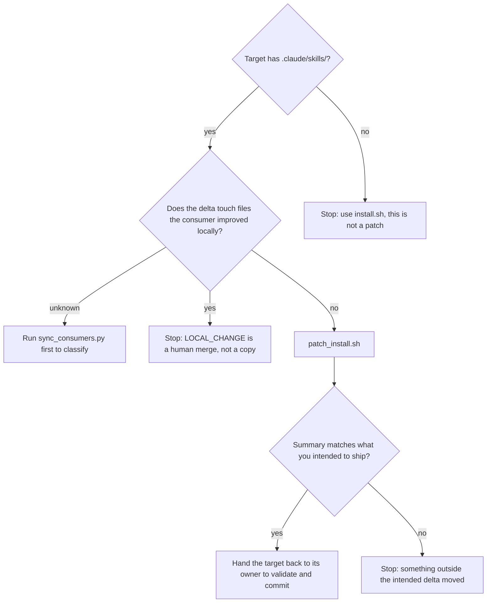

# Patch an existing install

## Purpose

Bring a consumer that already has the kit up to the current version, copying only
what the manifest lists and touching nothing else. The distinction from
`install.sh` is the whole reason this script exists: `install.sh` removes
`.claude/skills/` and copies over it, which destroys every artifact the consumer's
own cycles generated.

## Prerequisites

- The target exists, has `.claude/`, and has `.claude/skills/` — that is, it was
  installed before. The script refuses otherwise rather than half-installing.
- You know what changed in the kit. A patch copies the manifest, so a file added
  this session and missing from the manifest silently does not travel.
- The consumer's generated artifacts are identified: SEPA-knowledge skills,
  `review-*-knowledge`, halt-loop prompts, `.progress-*.json`. These are what the
  patch exists to preserve.

## Steps

1. Run `bash mechanisms/dist/patch_install.sh <target-project-dir>`.
2. Read the created-versus-overwritten summary it prints. An unexpected "created"
   means the target was missing something it should have had; an unexpected
   "overwritten" means a file you did not intend to ship changed under someone.
3. Check `.claude/.patch-backups/retired/<timestamp>/` when the kit retired a
   skill. Retired skills are **moved there, never deleted**, so a wrong retirement
   is recoverable and a right one is auditable.
4. Confirm the artifacts the patch must not touch are untouched:
   `settings.json`, `settings.local.json`, `records/`, `agents/`, and any skill
   not in the manifest.
5. Run the consumer's own validation. The patch deliberately runs no tests in the
   target — a different environment — so nothing has yet proved the target works.
6. Leave the commit to the consumer. The script commits nothing, and a patch
   committed by the kit is a change nobody in that repository chose.

## Decisions

## Escalation

- A file you changed this session did not reach the target → the manifest is
  incomplete, which is a kit defect, not a consumer one. → the kit maintainer.
- The patch overwrote something the consumer had improved → recover from git in
  the consumer, then classify the file with `sync_consumers.py` before retrying.
  → the consumer's owner decides the merge.
- A retired skill was in use → it is in `.patch-backups/retired/`; restoring it is
  cheap, and the retirement decision goes back to whoever made it.

## Competencies

- Distinguishing a file the kit owns from one a cycle generated inside a
  consumer, which is what `.kit-manifest.txt` answers and guessing does not.
- Reading "nothing was deleted" as a guarantee about this script only —
  `install.sh --force` makes no such promise.
- Knowing that a patch that ran cleanly has proved nothing about whether the
  target still works.
