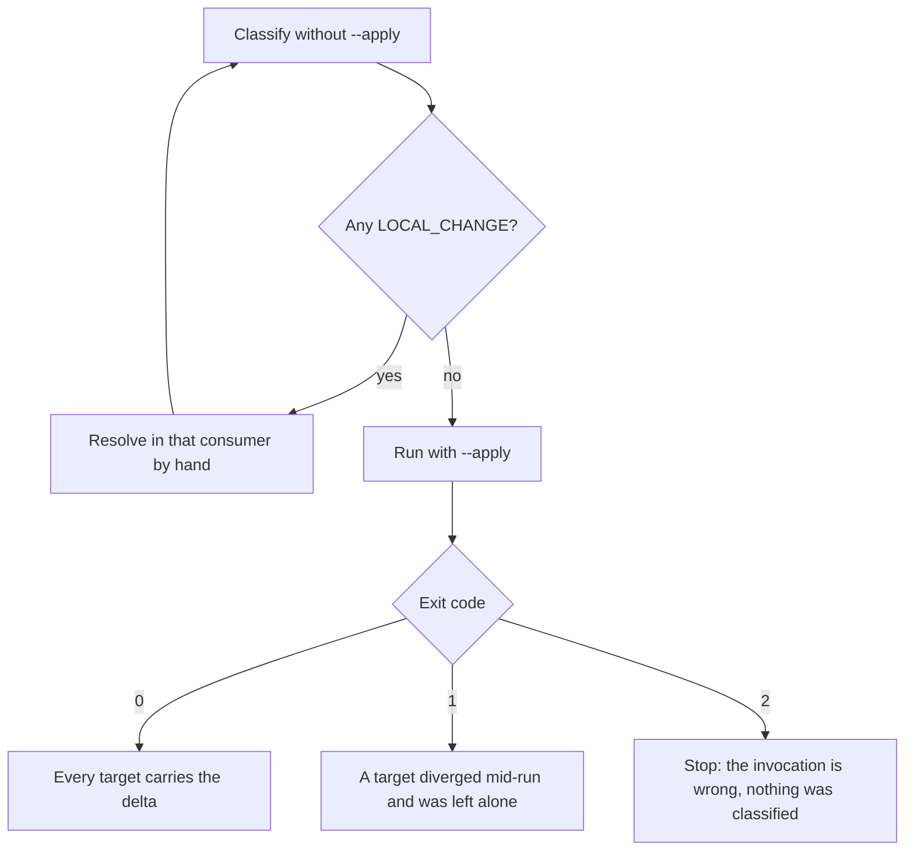

# Propagate a delta across consumers

## Purpose

Move a kit change into every project that has the kit installed, while refusing
to overwrite any file that project improved on its own. At the volume measured —
42 installs — "compare before copying" does not survive as manual discipline, so
it is a classifier instead of a habit.

## Prerequisites

- A base commit: the sha the consumers were last synced from. Without it the
  script cannot tell an update from a divergence.
- A target list: one project root per line. Building it by hand is where the
  count was wrong before — a sweep for `.claude/skills/implement/` once found 42
  where 11 had been reported.
- The delta is committed in the kit. The classifier compares three contents —
  the kit's, the base, and the consumer's — and an uncommitted kit file has no
  base to compare against.

## Steps

1. Run without `--apply` first:
   `python3 scripts/sync_consumers.py --base <sha> --targets targets.txt`.
   Nothing is written; the run classifies.
2. Read every `LOCAL_CHANGE`. Each one is a file that project changed after the
   base, and copying over it would erase a local fix. The script does not merge,
   deliberately: an automatic merge across dozens of repositories is how one
   mistake spreads everywhere at once.
3. Resolve each `LOCAL_CHANGE` by hand, in that consumer, before syncing it.
   Three real ones to expect: the `ECO=$(...)` layout convention some consumers
   carry and the kit does not, local additions to a checker's exemptions, and the
   project's own specialist list.
4. Re-run without `--apply` until nothing is `LOCAL_CHANGE`, or until the
   remaining ones are consciously excluded from this pass.
5. Run with `--apply`. `NEW` is copied, `UPDATE` is copied, `IDENTICAL` is
   skipped, and `LOCAL_CHANGE` is still refused — the flag does not weaken the
   classification.
6. Read the exit code as the summary: `0` means nothing awaits a human decision,
   `1` means at least one target diverged and was left untouched, `2` means the
   invocation was wrong (bad sha, missing target).
7. Leave each consumer's commit to its owner.

## Decisions

## Escalation

- A `LOCAL_CHANGE` that is a genuine improvement → port it INTO the kit before
  syncing, or the next pass will keep reporting it forever. → the kit maintainer.
- A target missing from the list → the count is wrong, and a consumer silently
  stays behind. → re-derive the list by sweeping for an installed marker rather
  than from memory.
- A file that classifies `UPDATE` but breaks the target after copying → the kit's
  change was not backward compatible for that consumer's layout. → stop the pass
  and fix it in the kit, not in the consumer.

## Competencies

- Reading `LOCAL_CHANGE` as information rather than as an obstacle: it is the
  script naming a place where the kit and a consumer learned different things.
- Resisting the merge. The script's refusal to merge is the feature; automating
  past it converts one bad judgement into 42.
- Deriving the consumer list by measurement, not from the list you remember
  installing.
